I've always been a big fan of "year in reviews" write-ups, despite some hesitancy in calling it a "*review*" this time around. Let's go with *self-reflection* instead.

Last year was the first time I skipped a yearly self-reflection: I didn't write one up publicly nor privately. This wasn't out of laziness or lack of time, but an intentional action to prevent me from acknowledging how awful a year 2021 had felt like. Granted — in hindsight, no terrible thing happened last year, but I was feeling like shit, burnt out and unmotivated.

So as I reflect on 2022, I'm hoping this will also help me reflect on how I'd like 2023 to be. While I was never on to set and focus on goals, I do very much enjoy the idea of focusing on yearly "themes". I [recently wrote about how I choose to look at goals](https://blog.ricardofilipe.com/new-year-reset/), come January 1st, and this year will be no different.

This year will also be remembered as my first year experiencing COVID: in fact, I sit here today on day 12 of COVID still testing mildly positive, which I hear it's quite the rare feat.

Let's see what I come up with reviewing 2022.

- [Personal Life](#personal-life)
  - [Lockdowns and immigration](#lockdowns-and-immigration)
  - [Wedding celebration](#wedding-celebration)
- [Professional Life](#professional-life)
- [Side Projects and hobbies](#side-projects-and-hobbies)
  - [In tech](#in-tech)
  - [Outside of tech](#outside-of-tech)
- [In Fitness](#in-fitness)
  - [Running](#running)
  - [Biking](#biking)
  - [Climbing](#climbing)
- [Travel](#travel)
- [Reading](#reading)
- [Other Interests](#other-interests)
- [Favourite Purchases](#favourite-purchases)
  - [Running shoes: Hoka Arahi 6](#running-shoes-hoka-arahi-6)
  - [FrontEnd Masters Subscription](#frontend-masters-subscription)
  - [Sony FE 1.8 85mm](#sony-fe-18-85mm)
  - [Ice skates](#ice-skates)
- [2023](#2023)

## Personal Life

### Lockdowns and immigration

There's a lot that I could fit in this category, some good things and some not so good things. Let's start with the bad, which then turns into good.

At the beginning of this year, Canada (especially Quebec) was still in lockdown under a mandatory curfew. It's absolutely nuts to think that less than 12 months ago, I still wasn't legally allowed to step out of our apartment after 8pm. Being under the strictest lockdown in the entire North American continent (and also the longest) has really messed with how my perception of the world to this day. Sometimes I still look at the kitchen clock at 9pm and think there's a curfew outside.

Adding to the feeling of being stuck, between November and April I was also in an immigration limbo where I wasn't legally allowed to leave the country. Technically, I could _leave it_, I just wasn't allowed _back in_. In November 2021, I finally got my **Permanent Residency** (PR) approval for Canada, which was a massive win and relief. This meant no more work permits, no more being tied to a single job (at the time, Shopify), and just overall more freedom within the country.

However, between the time you're approved for PR and getting the actual PR Card (green card equivalent), you're not allowed to leave the country. Adding to the previous 2 years where I also couldn't leave for pandemic reasons, I was in a really dark place early this year, feeling that I was literally stuck in Montreal. My love-affair with Montréal and Quebec ended and I became bitter and bitter towards the province and, to a larger extent, Canada in general.

However, in April, I finally **received my PR Card in the mail** which was a huge relief. My wife and I immediately celebrated by spending a long weekend at a friend's house in Montpelier in Vermont, which despite only being a couple hours' away from us, was technically the first time I left the country in over 2 years.

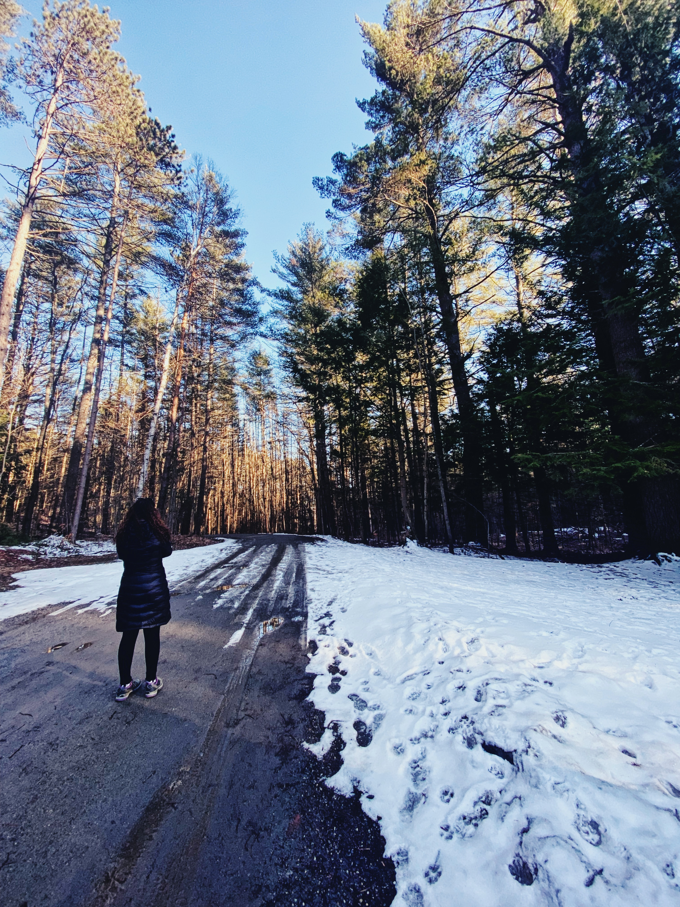

Little hike in the snow in Montepelier, Vermont.

### Wedding celebration

As the borders between US and Canada re-opened in April, we were preparing for our wedding celebration (we got married in 2020, though we didn't have any celebration) in May. The world was just beginning to open up and we were dead-worried about things going wrong; people not attending or getting sick, us getting sick and having to cancel our own wedding last minute, and so on. Luckily, everything worked out beautifully, and we got to marry again in front of some friends and family at one of our favourite venues in Montreal (where we actually met).

It was an amazing day, despite the fact that my own family and most of my friends from Europe couldn't come.

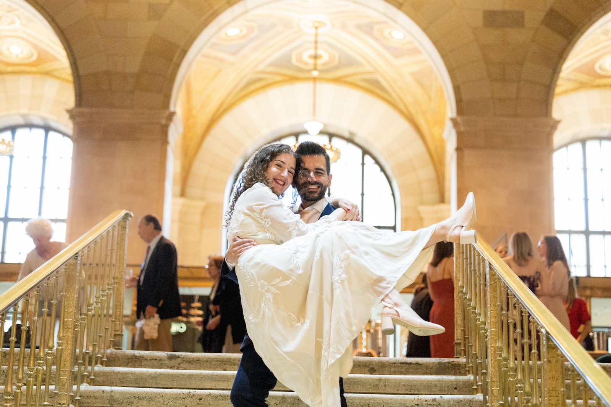

Our wedding celebration, in Montréal

It was such a magical day and everything we could have hoped for, especially after two years of harsh lockdowns and not being able to see family members. One for the books.

## Professional Life

From a professional perspective, this year was by far the most eventful I've seen in my whole career. In April, **I quit Shopify**, which was probably the most bittersweet moment I've ever experienced in my career. I'd been very vocal about how much I began to dislike what Shopify had become since going remote, and the values misalignment over the past two years had just grown to a tipping point. I was unhappy, but I also knew that Shopify represented a good 85% of my life in Canada; most of my friends, acquaintances and everything else, stemmed directly from these 4 and a half years at Shopify. It'd be very very difficult to let that go, but I was proud that I did.

Immediately after, I joined **Wealthsimple**, one of my favourite financial services in the whole world at the time. Smaller company, lots of people I knew already, they still had an office in Toronto I could visit from time to time (unlike Shopify), and working directly with a good friend — all of these things made it a no-brainer to work for them.

But of course, *2022* happened, and in July a lot changed when the company did mass layoffs. While I wasn't affected by them, a good two-thirds of my team did. Suddenly, everything felt... different. At the time, I was also realizing that working remotely was the definitive pain point for me, regardless of who I was working for. Thus began more dissatisfaction with my work: I felt alone again, unmotivated and disengaged, and with the company in high-savings mode, it was clear I wasn't going to get to travel as much as I hoped in order to meet colleagues and create those connections I'd been craving.

And so, like so many others this year, I started interviewing. With some companies I interviewed for all the wrong reasons (💰), and I was devastated by not getting one or two I had really high hopes for. In the end, I started a new position (also as a senior front-end developer) with the good folks at **Mercury**, and it's now been exactly a month since I started. Unfortunately, it's also a remote position, although with much better chances of travelling within the US, which I'm really excited about.

I'm still not completely satisfied by my relationship with work; I really miss going to an office a few days a week. Montréal is a bit of a tech-desert these days, with most options being highly underpaid or very unappealing. Part of me still daydreams of being in a major city like Vancouver or Toronto so I could finally, maybe, begin to love work again.

## Side Projects and hobbies

### In tech

This one hits hard: pretty much nothing happened in 2022, and I feel... ashamed? While time wasn't exactly on my side (I've spent hundreds of hours doing interview prep this year), this year was the definite death of my [typography newsletter](https://coffeetabletypography.substack.com/). Not a single issue was written, and while I'm technically still keeping the newsletter open, I haven't had any motivation to write or do research at all.

I did pick up a personal project though, as an excuse to learn more full-stack development using Next.js and Postgres, but even that is going tremendously slow (a book management system for our bookshelves in our apartment). I do plan on continuing this next year though, but it's very likely that I'll never get to finish the basics.

### Outside of tech

In 2020, I got really into flight simulators, especially since discovering I could run the fantastic X-Plane on a Mac. More than the "gaming" aspect of it though, I became somewhat obsessed with aviation details like navigation, planning flight routes, in-air processes, etc., and I've logged something like 100 hours of practice and flight time.

This year I've been doubling down on a lot of aviation theory, and I'm enjoying every minute of it. X-Plane just came out with a new version (12), and while technically "a game", I've been using to put into practice all the navigation theory I've been learning from a lot of educational resources, reading charts, etc. I've been mostly focused on small aircraft in order to focus on simpler tasks, but dare I say it, I became an aviation nerd these past couple of years!

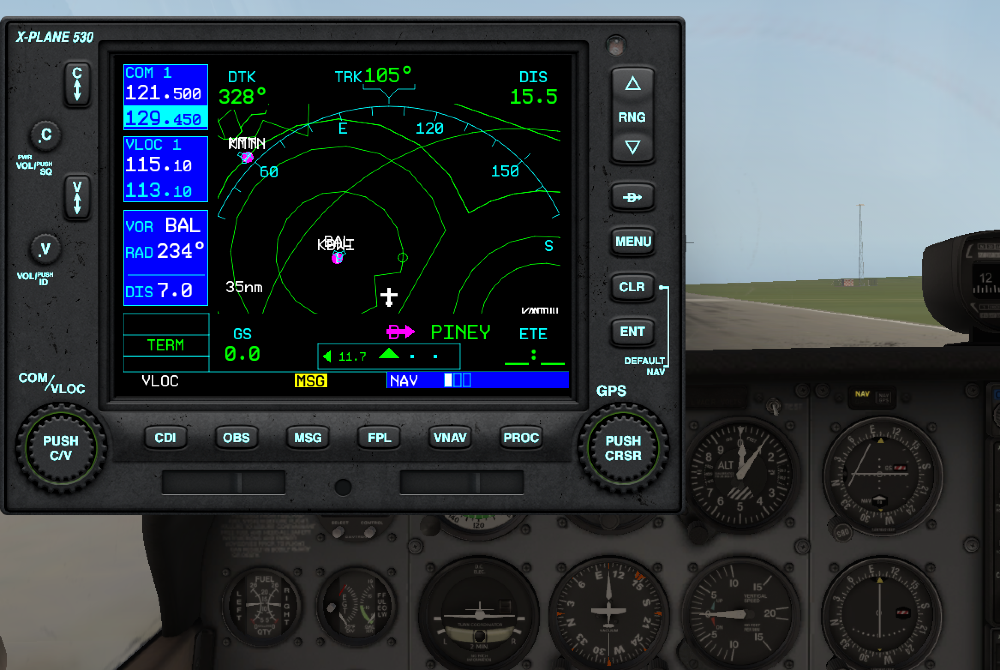

Making better sense of this has been a fun long-term project.

I am still however, very much out of love with flying. Having spent two years without flying during the pandemic really did a number on my fear of flying and despite still doing it as much as I need to, I'm less and less likely to take a plane instead of a train or a car, if possible. So while I'm really enjoying learning about aviation and taking off and landing a small Cessna... I'm very unlikely to get that pilot license.

## In Fitness

Both 2021 and 2022 were injury-prone years, in a way that I had never really experienced in the last ten years of running. This means that my mileage also took a big hit this year, mostly due to the dreaded *plantar-fasciitis* foot injury: this once again came out of nowhere for more than 2 months during the summer. And for the past 2 weeks, with COVID, I didn't get to do any running either.

### Running

**Total mileage: 1328km** (goal was 1750km)

| Distance | Time | Elevation |
|:--|:--|:--|
| 1328km | 117h | 5,426m |

No races this year either, which means no records broken or even matched. My longest run was **28km** in April, after which followed plantar-fasciitis problems, and I've stayed away from runs longer than 20km since then. After rest and physiotherapy, as well as a change in shoe type, the PF seems to be mostly gone but it's likely to come back again next year.

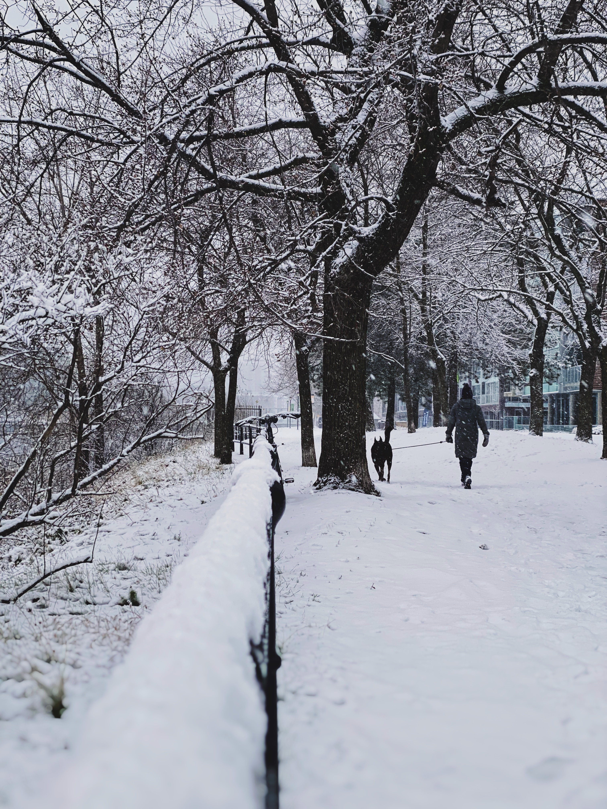

First snowy run of the season.

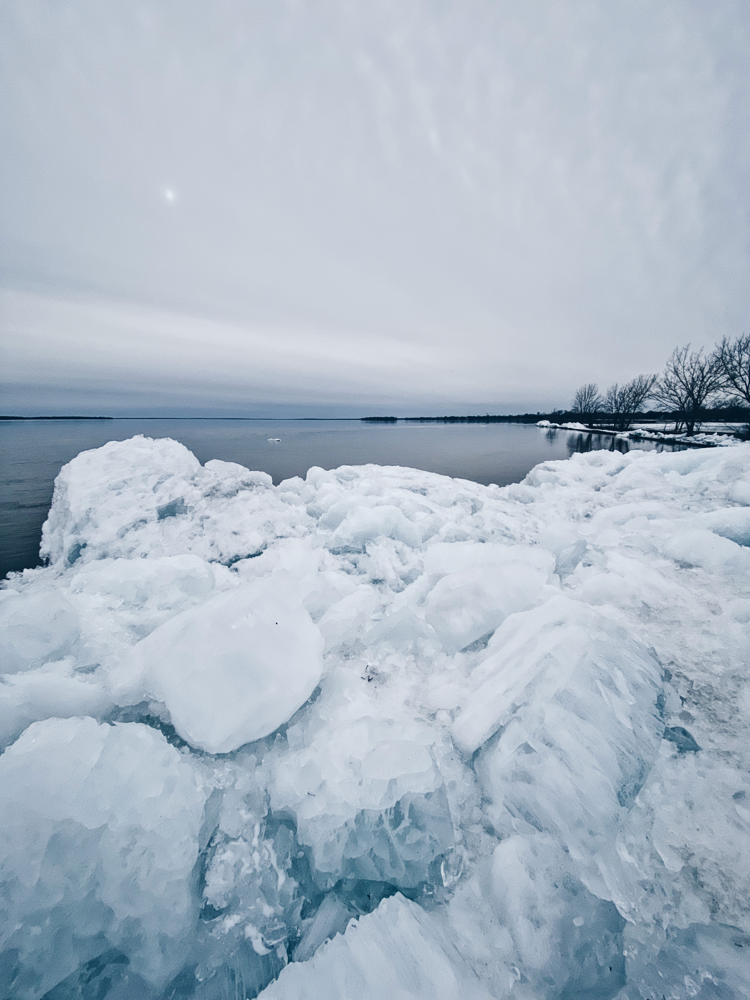

End of Lachine Canal looking like a scene from Iceland.

### Biking

**Total mileage: 759km** (goal was 1000km)

| Distance | Time | Elevation |
|:--|:--|:--|
| 759km | 35h | 4,638m |

Cycling also took a hit, although most of my mileage was pretty condensed between May and September. Once again I made heavy use of the Formula 1 track near me (Circuit Gilles-Villeneuve), which is a fantastic running replacement since I get to go fast and try to break lap records without worrying about being ran over by a car.

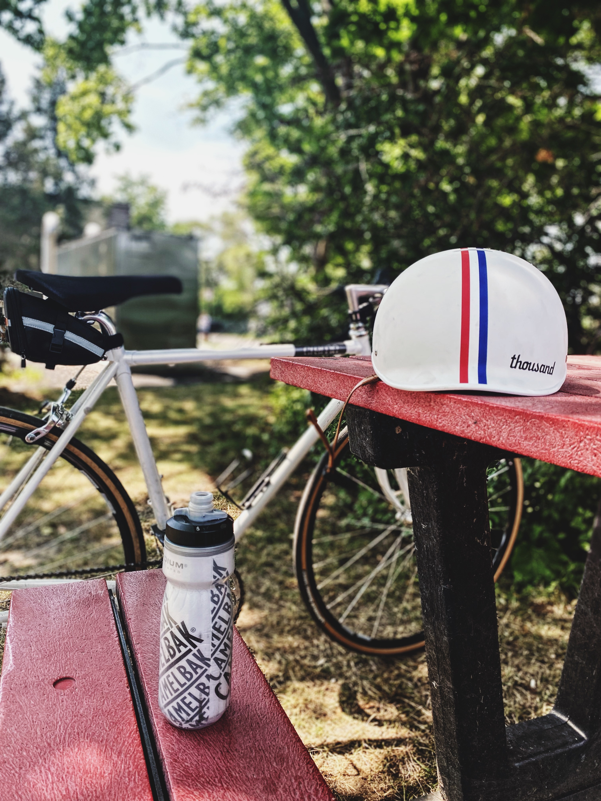

Taking a break from lapping the circuit.

Earlier in the year during winter I also hopped back on Zwift (virtual indoor cycling), which is still great fun and a fantastic way to keep fit during the harshest winter months. I'm excited to set the whole thing up again this winter.

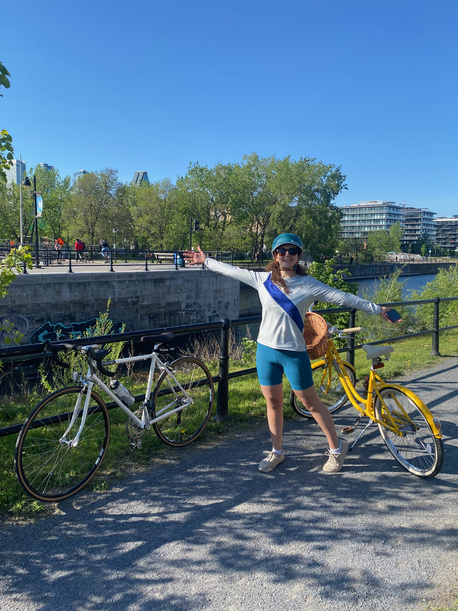

A sunny ride in the Lachine Canal at the end of Summer.

### Climbing

Rock climbing played a major role this year too, making up for the complete lack of climbing during the pandemic. This year I finally got re-certified for rope climbing, so I've added that to the mix as well. While I didn't necessarily get better at climbing this year (still stuck doing V5 and V6s in bouldering, just like I have for the past... 3 years?), it's been heaps of fun.

## Travel

As I stated earlier, in April I finally got the green light to travel again, from an immigration perspective. I knew then that this year had to be the one where I'd finally see my family again in Portugal, and I'm happy to report this has finally come to fruition!

In June, my wife and I spent 12 glorious days in Portugal, both seeing my family and travelling around a little bit. She absolutely fell in love with Lisbon, as one does, and I even got to see friends in my old university town, Aveiro.

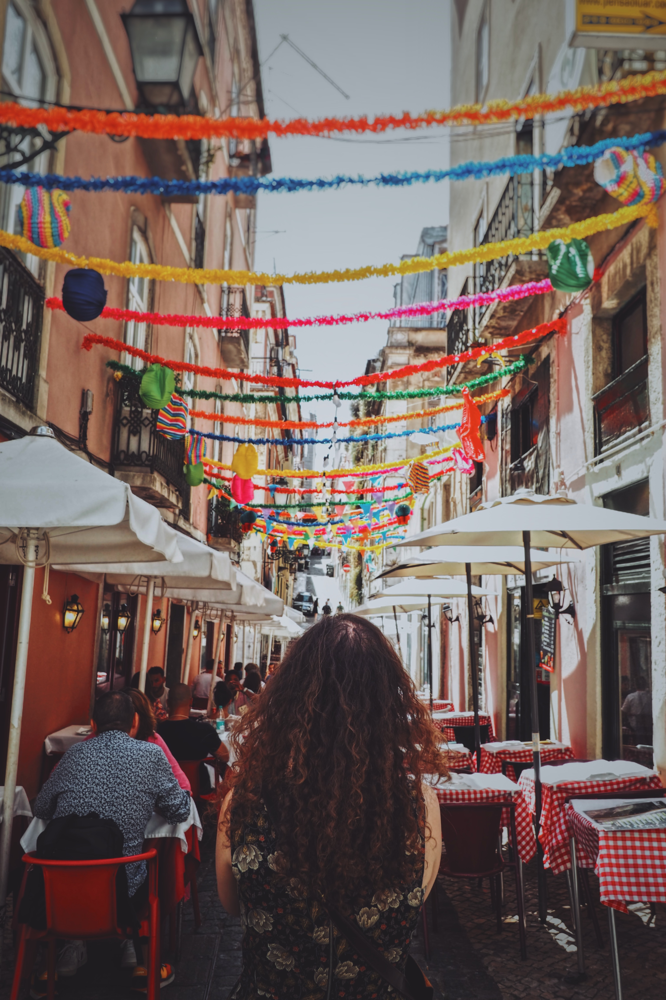

My wife wandering into a gorgeous narrow alley in Lisbon

However, this was our only international escape this year, since we had a lot of other plans already in the pipeline for North America.

**We saw Halifax**

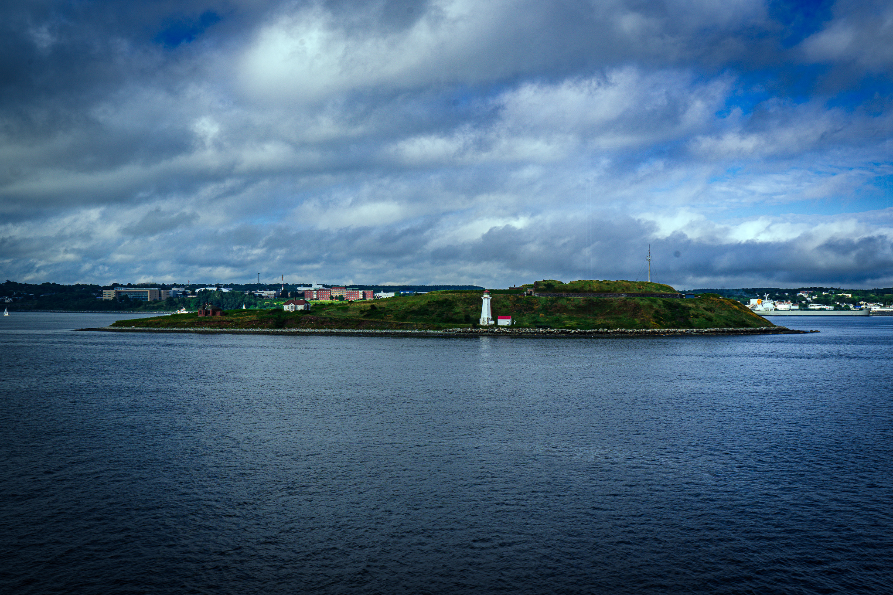

Lighthouse in Halifax.

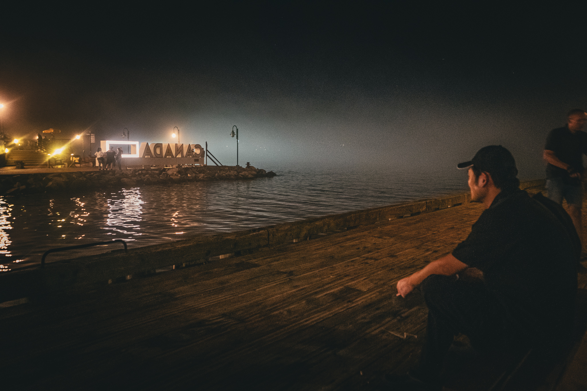

The docks, at night.

**Spent a few days in New York**

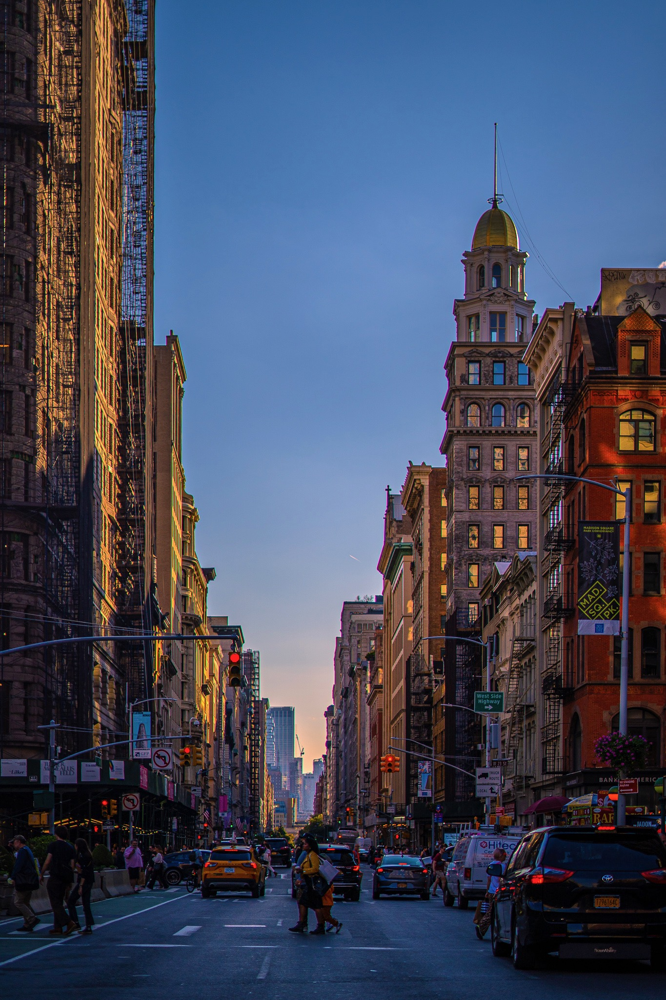

Manhattan.

**Drove down to Massachusetts**

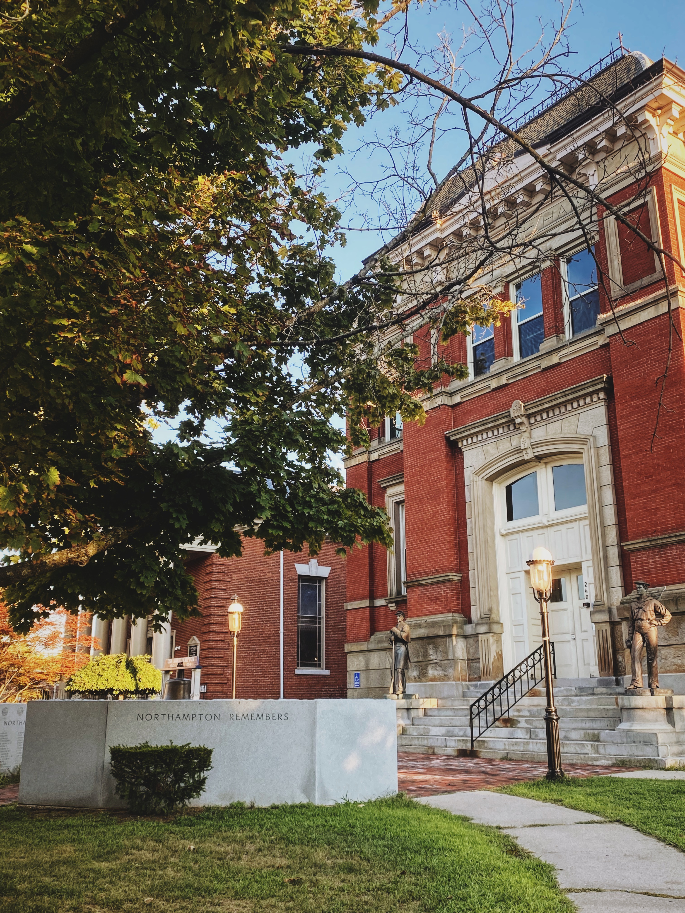

Northampton, MA.

**Spent some time in Toronto**

(no photos, because Toronto is the ugliest city in the world)

**And a few odd days exploring Quebec**

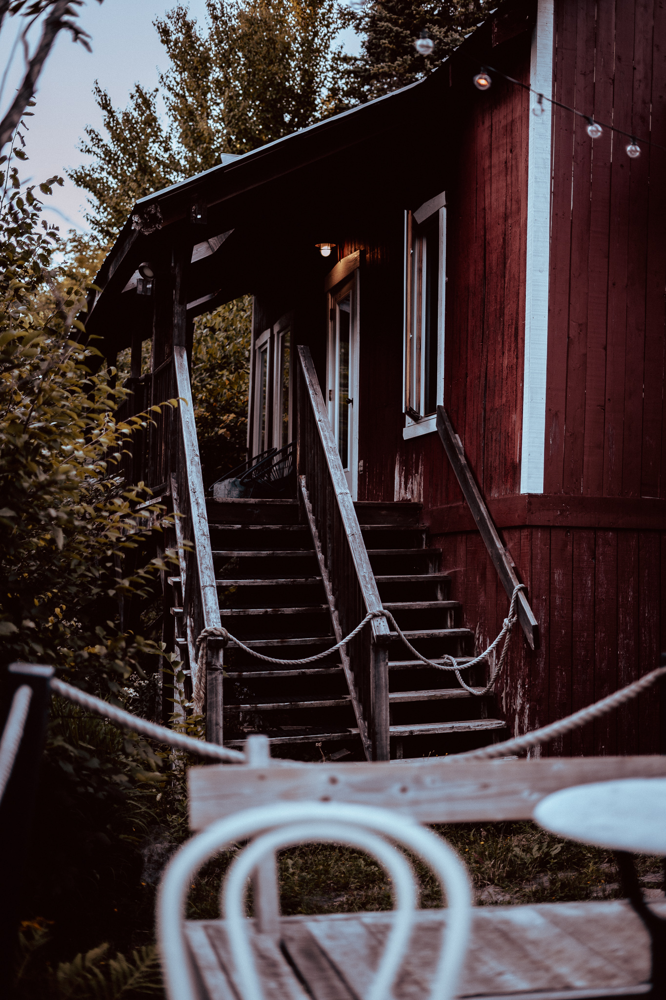

An old cottage in Quebec.

## Reading

Confession: this was also the year of... distractions. I probably spent more time glued to screens than any other year, and that includes my 2020 obsession of keeping track of COVID numbers daily. Between Twitter (and Mastodon), Instagram (a lot of it), and an unhealthy amount of newsletter reading, I could have certainly spent less time watching dumb content and more time reading books.

I only read 17 books this year, which is the lowest I can remember. Here are the books I read:

- The Fifth Season, by **N.K. Jemisin** ⭐️⭐️⭐️⭐️

- When Things Fall Apart, by **Pema Chodron** (re-read) ⭐️⭐️⭐️⭐️⭐️

- Atomic Habits, by **James Clear** ⭐️⭐️⭐️⭐️

- Blink, by **Malcom Gladwell** ⭐️⭐️

- Foundation, by **Isaac Asimove** ⭐️⭐️⭐️⭐️

- The Help-Yourself City, by **C.C. Douglas** ⭐️⭐️⭐️

- Staff Engineer, by **Will Larson** ⭐️⭐️⭐️⭐️

- Old Possum's Book of Practical Cats, by **T.S. Elliot** ⭐️⭐️⭐️⭐️⭐️

- The Data Detective, by **Tim Harford** ⭐️⭐️⭐️⭐️

- Going Postal, by **Terry Pratchett** ⭐️⭐️⭐️⭐️⭐️

- Sea of Tranquility, by **Emily St. John Mandel** ⭐️⭐️⭐️⭐️⭐️

- Out of My Head, by **Tim Parks** ⭐️⭐️⭐️

- The History of Montreal, by **Paul-André Linteay** ⭐️⭐️⭐️⭐️

- Hard-boiled Wonderland and the End of the World, by **Haruki Murakami** ⭐️⭐️⭐️⭐️⭐️

- Kissa by Kissa, by **Craig Mod** ⭐️⭐️⭐️⭐️⭐️

- Grokking Algorithms, by **Aditya B.** (re-read) ⭐️⭐️⭐️⭐️⭐️

- The Travelling Cat Chronicles, by **Hiro Arikawa** ⭐️⭐️⭐️⭐️

And currently reading another one of my favourite series in the world, "*[One of Our Thursdays is Missing](https://www.goodreads.com/book/show/8131227-one-of-our-thursdays-is-missing)*" by Jasper Fford.

As usual, the highlight goes to one of the books I usually re-read every year and desperately need so. *"[When Things Fall Apart](https://www.goodreads.com/book/show/687278.When_Things_Fall_Apart)"* by Pema Chodron continues to be, perhaps more so now than when it was released, a loving and kind-natured reminder of how to navigate a world that very often seems like it was designed for pain and suffering. Every time I read it though, I end up highlighting different passages from prior years, which reflects as a true statement on how a well written book, one with depth, will serve you well on multiple readings at different times of your life.

Some passages from this year's highlights:

> “We think that if we just meditated enough or jogged enough or ate perfect food, everything would be perfect. But from the point of view of someone who is awake, that’s death. Seeking security or perfection, rejoicing in feeling confirmed and whole, self contained and comfortable, is some kind of death. It doesn’t have any fresh air. There’s no room for something to come in and interrupt all that. We are killing the moment by controlling our experience.”

> “Relaxing with the present moment, relaxing with hopelessness, relaxing with death, not resisting the fact that things end, that things pass, that things have no lasting substance, that everything is changing all the time—that is the basic message.”

> “The most fundamental aggression to ourselves, the most fundamental harm we can do to ourselves, is to remain ignorant by not having the courage and the respect to look at ourselves honestly and gently.”

## Other Interests

This year also had a theme in which I spent an ungodly amount of time researching on, writing about and engaging with: **urban planning and city development**.

In hindsight, I should have known that city development would be the one topic that would suck me into politics and civil engagement: I just wasn't paying attention to the signals before. In 2015, I read a magnificent book called *"[The Happy City: Transforming Our Lives Through Urban Design](https://www.goodreads.com/book/show/13330588-happy-city)"* by Charles Montgomery. At the time, my experience with cities was strictly narrowed down to European and Asian ones (I remember reading this book while spending a few months in Chiang Mai), and I remember falling in love with the subtle details that go into shaping how we perceive our daily lives as we walk down our cities. Since then, I have gifted my book copy, bought another one, gifted that one too, and bought a third one. Cities are spectacular places that have an infinite amount of invisible design built in: revealing that formerly invisible design to me proved fascinating. But back then, this wasn't political to me.

Cut to the pandemic: as I bought a car in early 2021, I realized how awful North American cities are to drive in compared to (some) of Europe. Long and complicated roads, highways which are congested at any given time of day: it made me miserable to drive here, much more so than decades of European driving ever had. So I doubled down on biking and walking, and that made me notice how utterly broken North American cities are for pretty much just everyone. Right turns allowed on red lights? No zebra crossings and no roundabouts? Four-way intersections everywhere larger than the Titanic? _Fuck all this_, I said, repeatedly.

As I explored more of Canada, I also realized how awful most towns are: industrial complexes, with long and dangerous stroads connecting the same urban complexes with giant parking lots, are the norm... everywhere. I immediately fell out of love with Canada. Realizing that every  town is the exact same industrial block + parking lot combo everywhere made me ungodly angry, and so began my obsession with consuming urban planning content from places as [Not Just Bikes](****) and so many other [urban planners](https://indieweb.social/@BrentToderian@mastodon.online/109599476694425892) and urban consultants on Twitter and Mastodon (there are probably more than you think).

So I've found a wonderful, vocal and active community on urban planning and city design this year, but I'm also systematically angry at how broken things are over on this side of the pond (not to say that European cities are perfect, very far from it). I need to tread this lightly. I do believe that my efforts to do Social Good™ here will be a theme into 2023 onwards too.

I feel desperately compelled to be an advocate for pedestrian-first, accessible, well designed car-free cities, more than I've ever been in my life.

## Favourite Purchases

Both material and non-material, there have been a few things this year where spending the extra bucks have made my life either easier or better; sometimes both.

### Running shoes: Hoka Arahi 6
Remember the plantar fasciitis issues I mentioned above, which kept me from running for months on end? While a lot of my recovery came from physiotherapy and rest, I'm 100% sure that preventing it from re-appearing came from switching from my trustworthy Nike Pegasus to the [Hoka Arahi 6](https://ca.shop.runningroom.com/en_ca/hoka-men-s-arahi-6-d-width-running-shoe.html). What an incredible shoe.

It took me a little getting used to Hokas: they're a stability shoe with a fair amount of padding, a feature I typically never really enjoyed. But since switching to them 700km ago (I need a new pair, yes, I know), the truth is that I haven't even felt a pinch of plantar fasciitis pain in my foot!

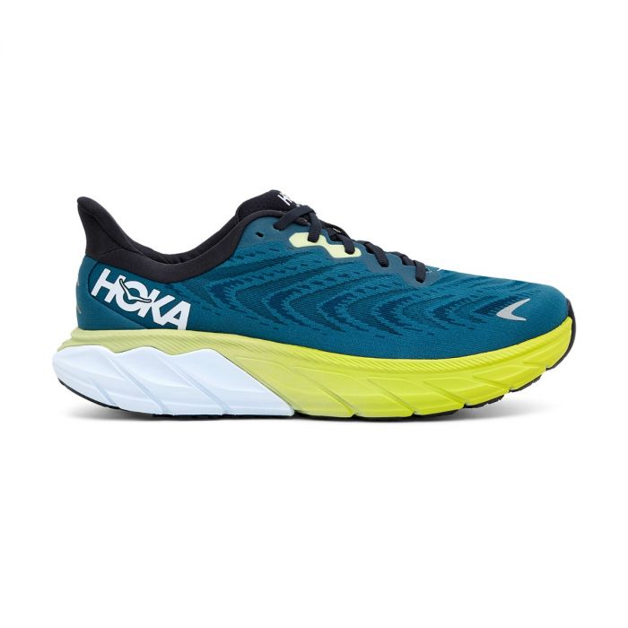

These shoes did wonders for my plantar-fasciitis.

### FrontEnd Masters Subscription

Those who know me know that I may be a little too addicted to courses. Yes, I should spend more time creating than consuming other people's content. However, this year I went all out on a FED Masters subscription and I can genuinely say that I've learned so many engineering topics that I wouldn't have otherwise learned.

The caveats are: the courses are very long (an average course is 7 hours) and the monthly subscription is very expensive. It was incredibly useful to learn a good amount of React Native before I needed it for work, and to finally take a deep dive into SQL/Postgres, for example, which is already coming in handy. If you have the budget to expense these courses and don't mind taking some 3 hours of your week to watch and follow along, then I'd highly recommend it.

### Sony FE 1.8 85mm

I finally caved in this year and bought a full-frame camera. After years of sticking with the Micro Four Thirds format, and being ever so slightly disappointed with it for street photography, I pulled the plug on a Sony A7 III.
While I've been loving the camera, one lens has been mounted on it pretty consistently: [the Sony FE 1.8 85mm](https://dustinabbott.net/2019/08/sony-fe-85mm-f1-8-review/).

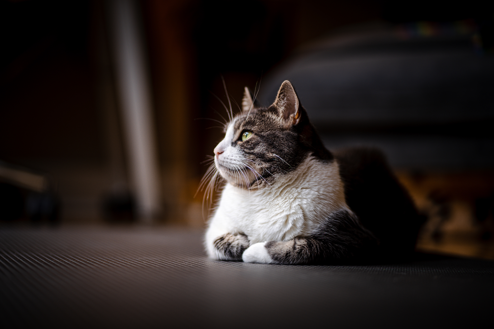

Freya looking contemplative.

I love this lens so much.

### Ice skates

I don't even know their brand off the top of my head — I'm just happy me and my wife got our own ice skates. We have a few ice rinks near us in the winter and the ability to just put  them on and go skate is so good. Everyone should skate. You should go ice skating now.

## 2023

My theme for this year was a follow up of the 2021 one, *"regeneration"*, but I think I did a poor job at it. 2021 had made me bitter, sad and angry with the world and its people, as I was noticing the widening of many social gaps and a much less united humankind. Unfortunately, 2022 didn't help with this: watching the world take so many steps back in terms of what we had slowly built for our global civilization was disappointing to say the least. If 2021 saw me sad and angry, 2022 saw me with nothing but sheer outrage. I even punched a car that ran a red light and almost ran over my feet. True fact.

While I'm proud that I became more vocal and more active about social topics that fundamentally matter, I'm also aware that this engagement wasn't particularly healthy. Everything is so ungodly polarizing these days (from vaccines, to masks, to ban or not ban mysogonists from Twitter) that any civilized engagement quickly turns into hate and despise within a couple of conversational transactions. Until I learn how to properly cope with people like these, I must disengage and find other ways to "be a good citizen". While I don't mind having made enemies this year, I don't particularly feel good about it either.

I'd be a fool to think 2023 is going to be a better year; it isn't. But I'd be an even bigger fool to believe that anger, total disengagement and not listening to other's needs is any sort of better alternative. It isn't. Because the last three years undid so much of my sense of wonder towards the world, this is desperately on my plate of things to reclaim. When I look back at the few moments of bliss I had this year, they all had a common theme: **friends, family, a sprinkle of adventure**. While I still want to focus on my career this upcoming year as I finally feel motivated enough at Mercury, I also want to keep myself accountable to these three pillars of bliss. This year proved us all that we can't make assumptions about any current state of the world, and _riding the waves_ without a sustainable plan, one deeply rooted on personal values, can be really bad news before you know it.

A little more gratitude, a little more adventure and a lot more time spent with friends and family; looking inward more often during pockets of stillness; finding those pockets of stillness; these are all the themes I want to focus on for next year.

Happy new year friends. Be kind to one another 🥂

