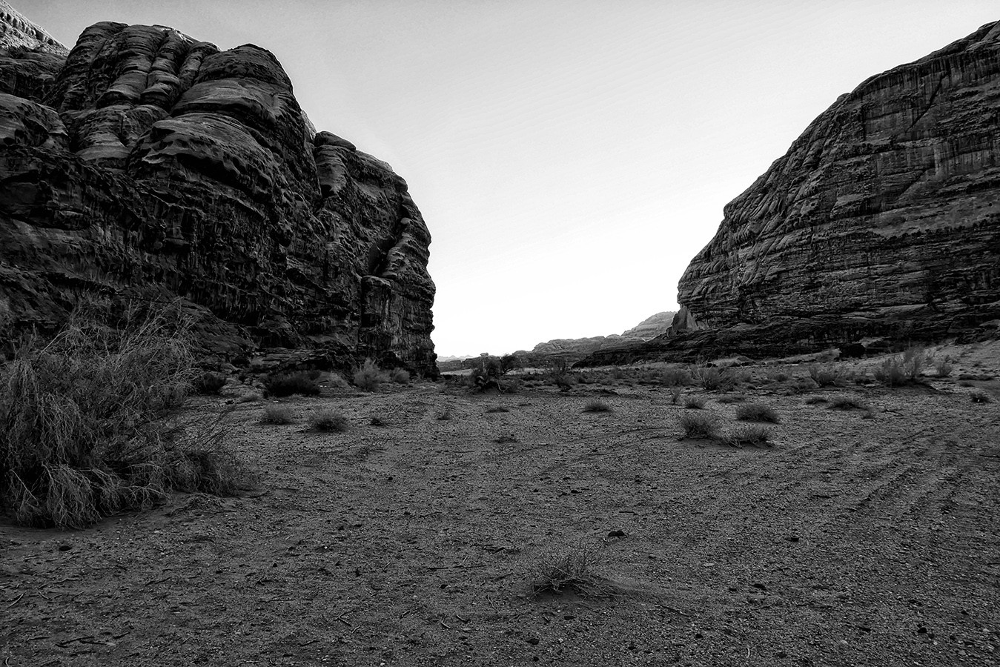

_I’ve always been curious about hiking the desert. And seeing the Middle East._

Curiosity, combined with the willingness to see with my own eyes how the atmosphere of a region that very often has it rough from the eyes of the media, the press and all kinds of misinformed people across the world. So I took the opportunity to join a small group of keen explorers in Berlin on an adventure that would take us through some of the bits of Jordan, mostly hiking the Wadi Rum desert, where we would sleep and interact with the Bedouins in their own natural habitat.

While I didn’t get to experience or see as much as I wanted, both living in the desert and interacting with the Jordanians were very enlightening. What follows is a small and short photo documentary of the trip.

#### Israel: the first stop

We landed in the airport of Eilat, a city in the southern part of Israel that’s mostly known for its resorts, relaxed beach life and everything else that you normally wouldn’t expect from Israel, at first glance. The airport itself is located in the middle of nowhere, quite literally, and it looks like it was built with ship containers stacked in the desert. In a way, I’m sure that’s what it is.

We managed to avoid getting our passports stamped, which by the way, is something most travellers should consider; [getting an Israeli stamp on your passport bans you from visiting most other countries in the Middle East](http://www.roughguides.com/destinations/middle-east/jordan/travel-neighbouring-countries/israeli-stamps-problem/).

After being held for some good two hours at the airport due to too many stamps in some of our passports (let’s not get into this), we finally broke free and managed to make our way into the city. Eilat, however, is an incredibly boring place, lacking life, content and soul… so I’ll happily skip it.

#### Crossing the border into Jordan

The plan was simple: drive off to the Aqaba border into the Jordanian side where we would continue to drive into the **Wadi Rum** desert.

Usually, this is a very simple procedure. No visa was needed for this entry into Jordan, and the whole process was only supposed to take no more than an hour. Boy, how wrong were we.

Starting from **January 1st 2016**, regulations have changed and you are now required to get a visa in advance to enter Jordan. Puzzled, we were told we’d need to drive to Tel Aviv to get one, which would make us lose more than a day from our trip, making us realise that no one there really knew what we needed to do… not very helpful from their part. After negotiating with the border entities for about 5 hours, we were still denied entrance. Oops.

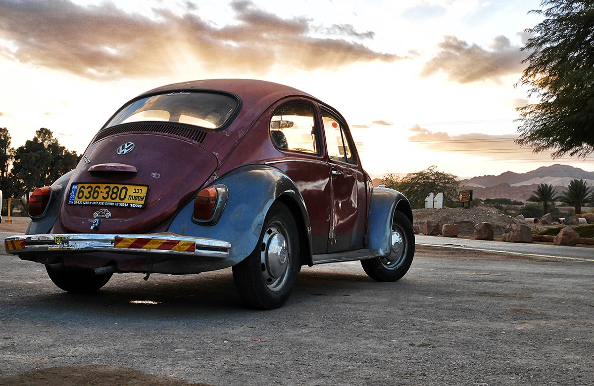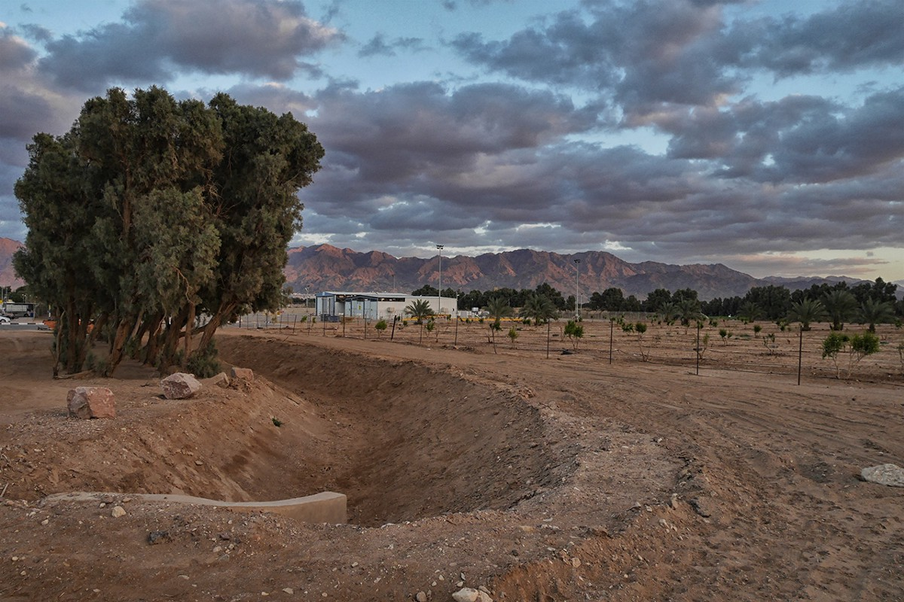

Our best option to get into Jordan, after losing a whole day already, was to buy the brand new **_Jordan Pass_**, a (rather expensive) document that includes an entrance fee to certain Jordanian sites, like Petra, and also conveniently includes a digital Visa that you can use at the border. Unfortunately, the border checks are still not ready for this system to be used efficiently and in the following day, we still lost almost 7 hours simply getting across the border.

Seven, long, hours. Too many checks, questions, suspicion, and too many guns in sight for my liking.

So, you’ve been warned. At the moment of writing, this piece of information still isn’t available on any guides, so please make sure you get a visa in advance if you’re planning to visit Jordan, whether or not you’re coming from Israel. Once we made our way into Jordan, most of what followed was smooth sailing. And so, after so much despair and playing the waiting game for more than a day, we reach our first camp at Wadi Rum.

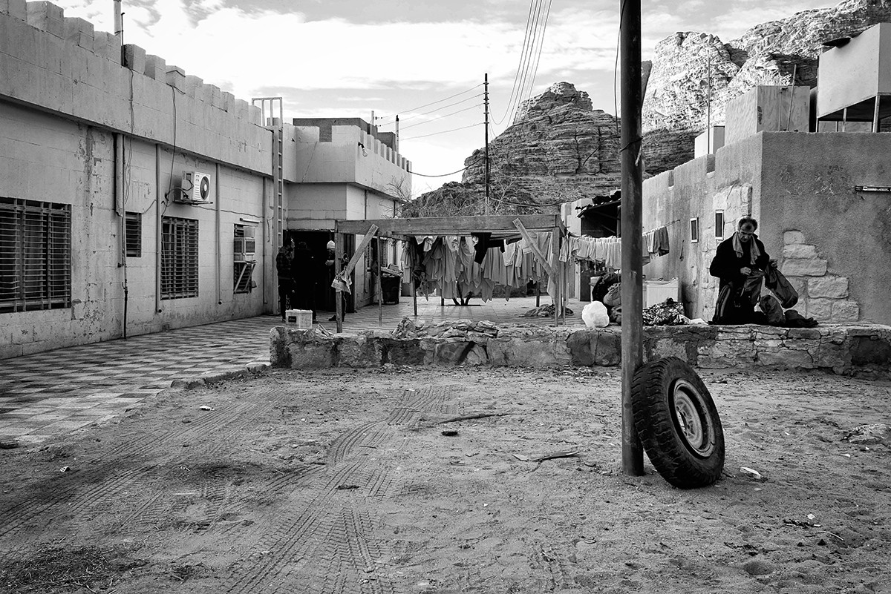

#### The simple life of Wadi Rum

Life in the desert is making the most out of everything you can get your hands in. In some ways, it looks like a post apocalyptical scenario; cars and wagons are used as recipients for vegetation or storage, hot water is a revolution yet to happen and the arid air of the desert is a reminder everything but gentle that life is simply rough under those conditions.

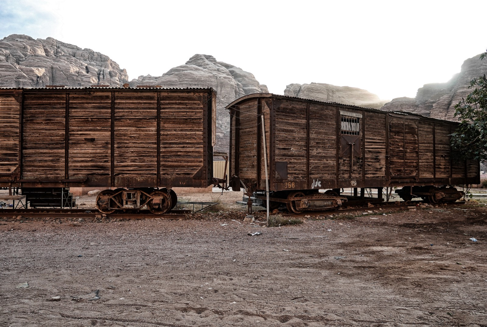

#### Wadi Rum

Hiking the desert is exactly as it sounds. One, step, after, the other. For many hours on end. The sound of nothing is disturbing initially, but you get used to it pretty quickly.

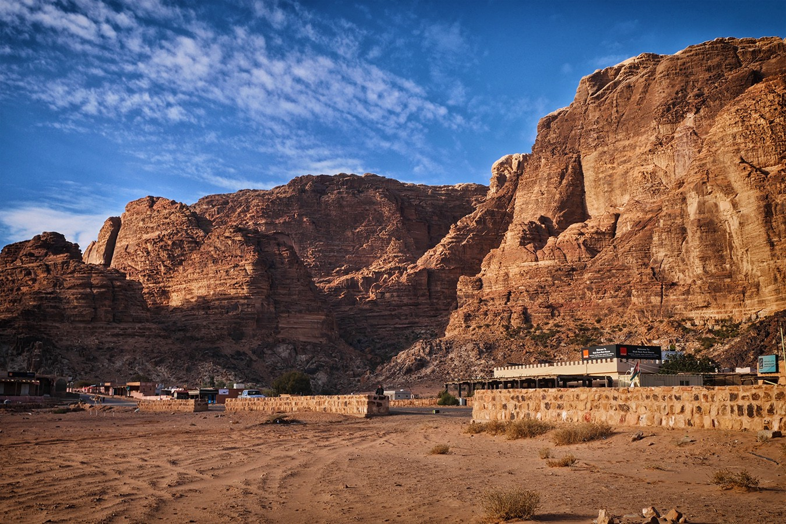

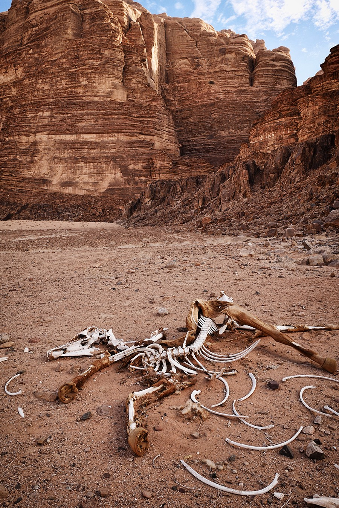

Occasionally, we would stumble upon some **Bedouins**. These brief encounters with the nomads were definitely the biggest lesson I’ve learned on this trip; a lesson on hospitality and being humble in ways that still make me feel guilty about the ways I live my comfortable, _suspicious-of-everything-and-everyone_ Western life.

Even though we were a group, random as we were, the Bedouins we’d encounter in the middle of nowhere would not only greet us, they also invited us to join them for tea and bread. The amounts of these nourishments were clearly limited and most likely to be one their few meals a day; and yet we had no shortage of offerings. Saying no to them was not an option, though.

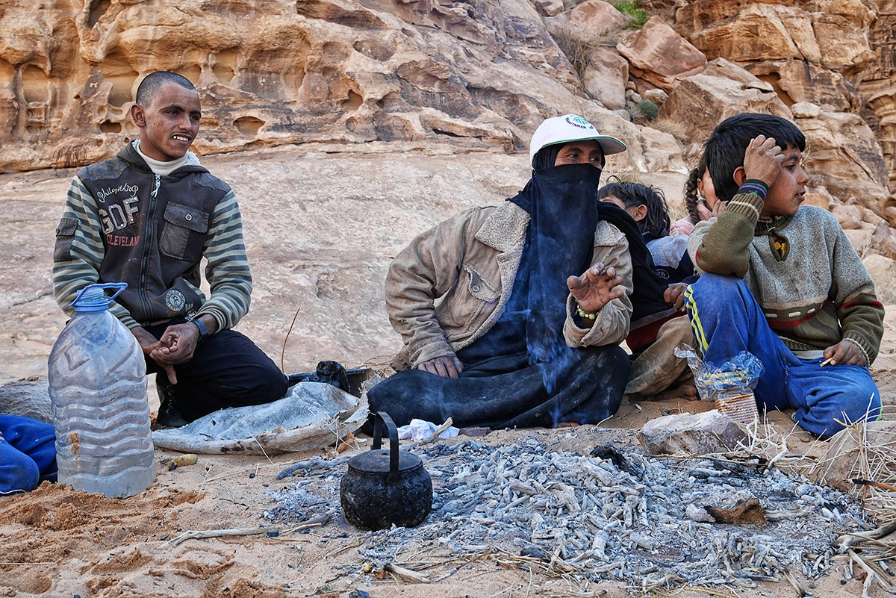

All of this made me fumble through my backpack and reach for all the chocolates and cookies I had left. I did my best to split them evenly amongst the children, always thinking that _“this isn’t enough”_. From that point on I always made sure to store a little bit of these treats in order to provide something back on future encounters with the locals, especially if children were involved.

Would we be as welcoming to random, smelly strangers in our big cities? Would I invite passers-by for a cup of tea? This is food for thought for another discussion, surely.

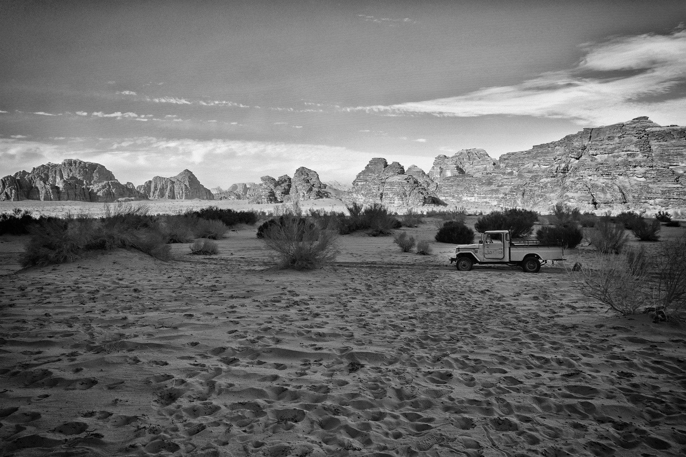

At night, we had our first stay in one of the Bedouin tents. As you’d expect, temperatures drop dramatically during the night, so before bed we all made sure to sit all together by the fire, exchanging stories and drinking unhealthy amounts of highly sugary tea. Again, no one was really complaining.

In the next morning, more of the _local architecture_ was in sight.

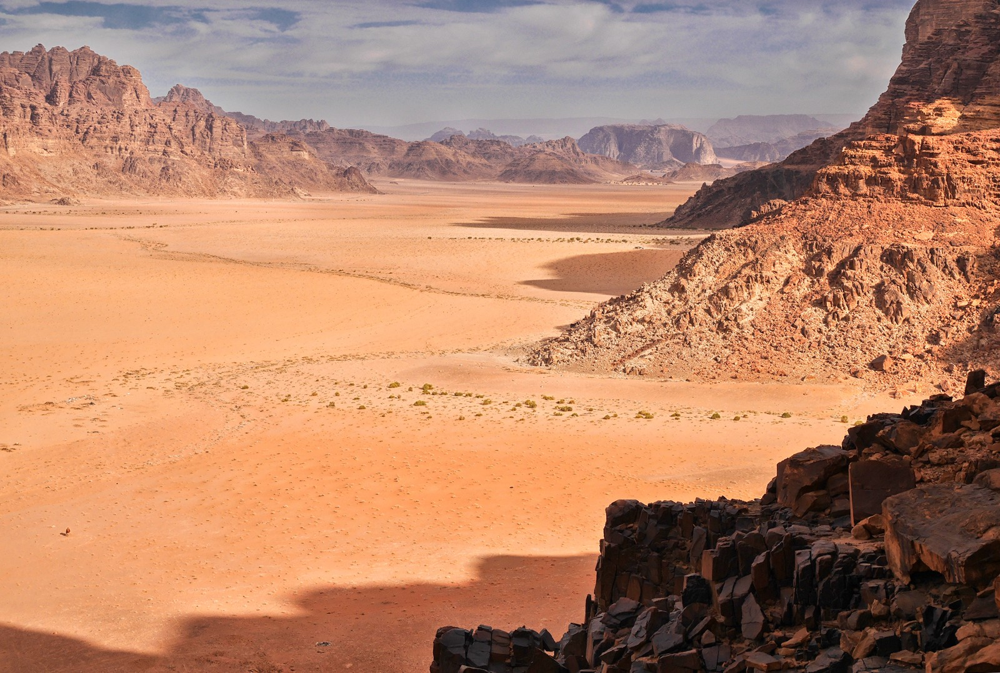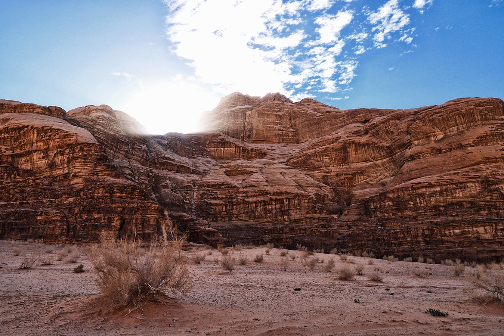

But the true highlight of the arid desert? The sunsets. Oh my lord, the sunsets. Darkness falls as quickly as a finger snap, though, and it will take you by surprise when you least expect it. I’ve gained a brand new level of respect for the desert after being stranded in the dark.

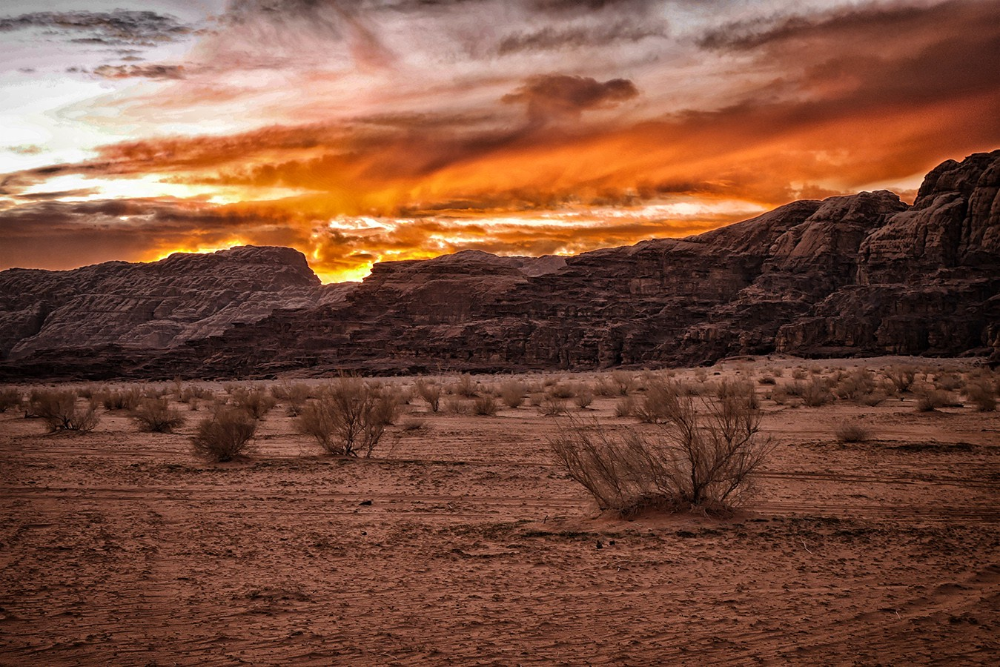

Darkness fell so rapidly, in fact, that we had no option but to call for rescue on one of the days. We still had almost an hour’s worth of walking to the next camp and even though the stars were fully visible in great company, both the visibility and the night temperatures were literally zero.

While we were waiting for rescue, some of us stumbled into another Bedouin tent where some locals were getting ready for the night. Once again, we were greeted beautifully with fire and tea.

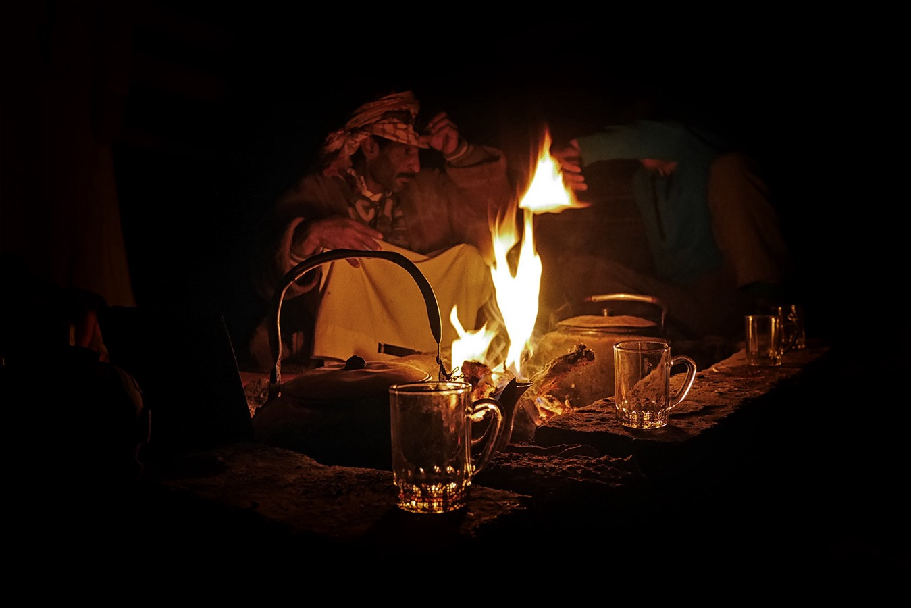

Once we were in the camp, however, life was great. The simple things meant the world; the Bedouin’s hospitality was truly remarkable, and after a few glasses of rum (drinking rum in Wadi Rum, check!) we were dancing together, singing songs from all different origins, challenging each other with tricks… overall, one of the best nights I’ve ever had. But this might have been the rum talking.

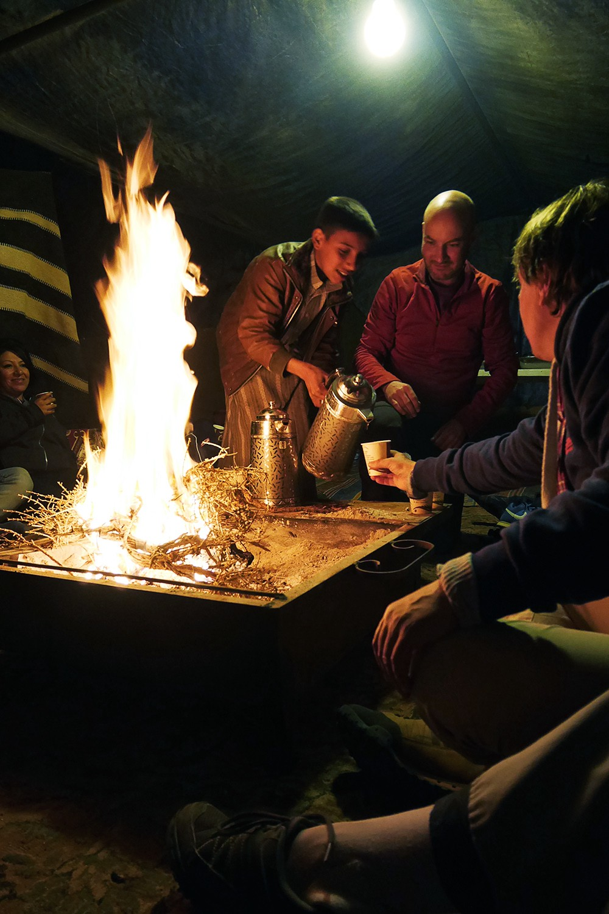

The next morning, endless more miles of hiking ensued. Again, with striking views every time I actually remembered to pause, take a break, and appreciate what was around me.

Just before we finished the last few miles, we made sure to stay just long enough to watch another sunset. This time though, lesson learned; we’d be picked up by jeep and driven to camp right afterwards.

---

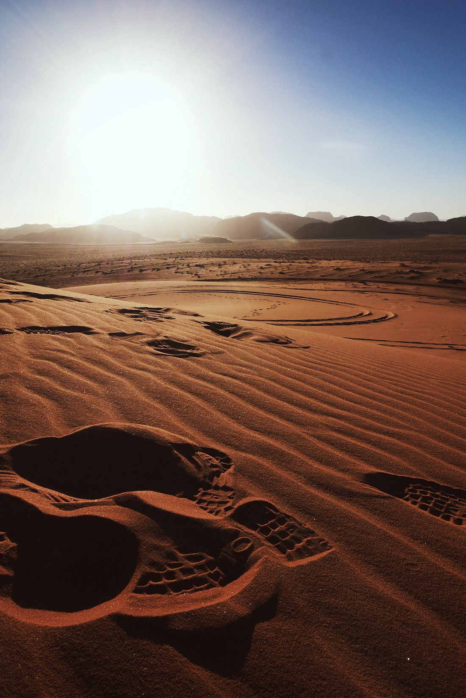

After three days in the desert, we packed up and drove north. Before **Madaba**, we thought we’d include a visit to Petra, since we had bought a ticket already with the mandatory visa.

By the way, driving in the Middle East is as you’d expect: more dangerous than walking the desert with no water, at night, with a snake around your neck. Blindfolded. In fact, driving in Jordan pretty much feels exactly like this.

#### Petra

Petra is… hard to describe. On one hand, I wasn’t expecting the sheer magnitude of the entire site. Walking from one end to the other can easily take up to an hour and a half, with very steep climbs along the way. It’s absolutely magnificent mind you, and no matter where you look you’re presented with absolutely glorious views.

On the other hand, it’s immensely touristy. In fact, the whole experience is completely ruined by many locals going completely out of their way to force-sell you postcards, camel rides, magnets and everything else you can think of. You simply want to get out of there as quickly as you can, and that’s exactly what I did. It’s simply not a comfortable place to be.

However, the further along you go, especially towards the Monastery, the less crowded it gets and you finally get to breathe a little bit. Getting off the beaten path is definitely a must in Petra.

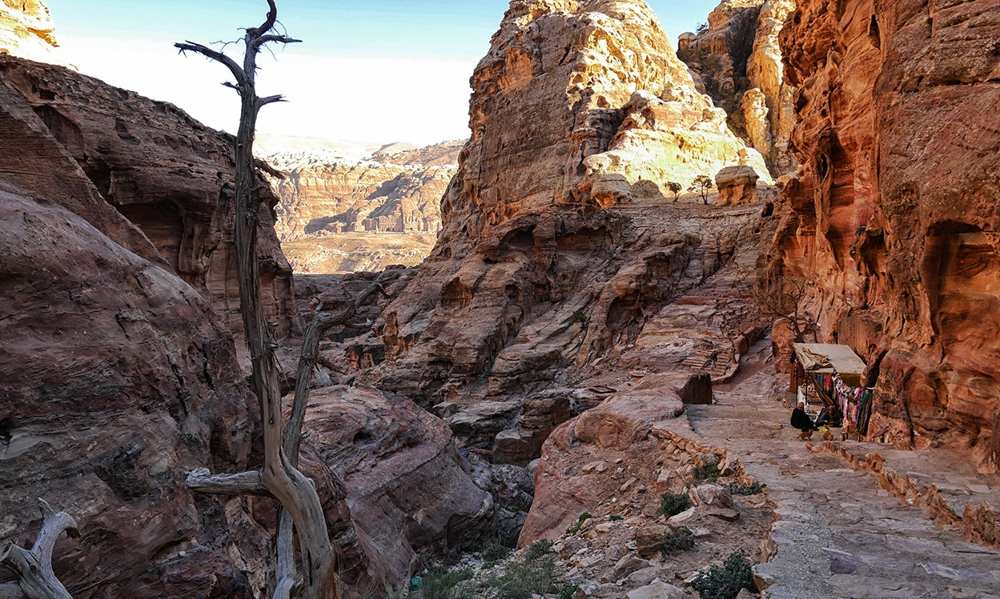

At the top, you’re greeted with the beautiful Monastery and a small café, where I made sure to get my Turkish-style coffee fix. You know, the little things in life.

It was also surprisingly empty, leading me to believe that most tourists are actually quite lazy and can’t be bothered to hike all the way to the top. For 100 EUR, you can bet I explored the damn thing all the way.

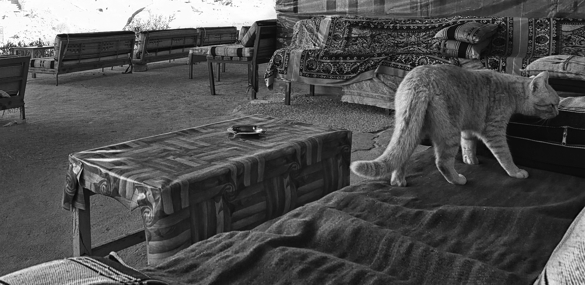

The Monastery unfortunately, impressive as it is, is not accessible. You can look at it, but it’s not possible to go inside. Apparently it was once used as a church, I can only imagine that it should be beautiful and very interesting on the inside as well!

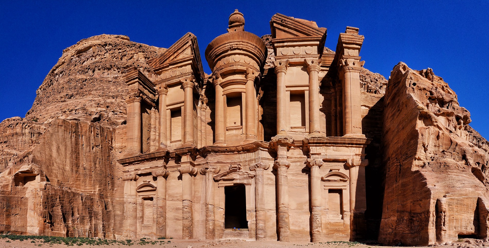

#### The Dead Sea

A trip to Jordan wouldn’t be complete without a swim in the Dead Sea. To those unfamiliar with it, it’s one of the saltiest seas on the planet, if not the saltiest one. This means that it’s literally impossible to drown in those waters, and the experience of being forced to float is absolutely mind-blowing and beyond earthly comprehension! Walking into the water and losing control of your own legs, which would immediately float upwards, stills begs belief in my mind.

In fact, just look at Robert. Look how happy he is, floating away.

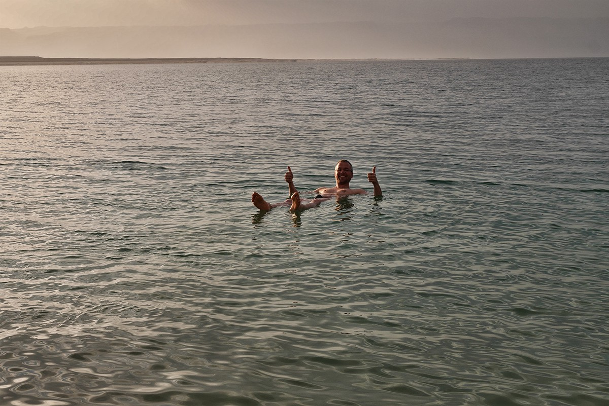

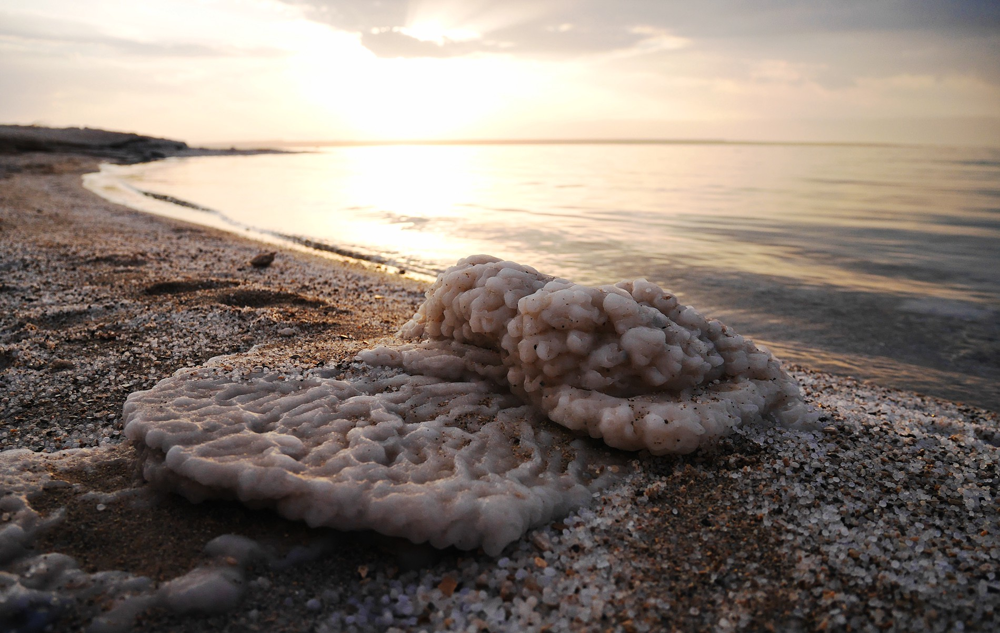

After all of this, we simply enjoyed a little bit of the simple life of **Madaba**, a quiet town about an hour away from Amman. At this point, I put my camera down and made sure I’d feel the place, instead of being on the search for more photographs. Not quite a photojournalistic approach to a trip, no, but then again I’m not a journalist. I was happy simply walking into the churches, enjoying the food, sipping the delicious homemade wine the folks at the Pilgrim’s House kindly offered us. All experiences I will cherish and bring with me until I’m no more than ashes.

I would definitely come back to Jordan, as it’s impossible not to feel like there’s so much more to see. Petra, however, seems surely overrated, and the true gems of this piece of land are hidden in the hospitality of their people and the pleasures of the simple life.
