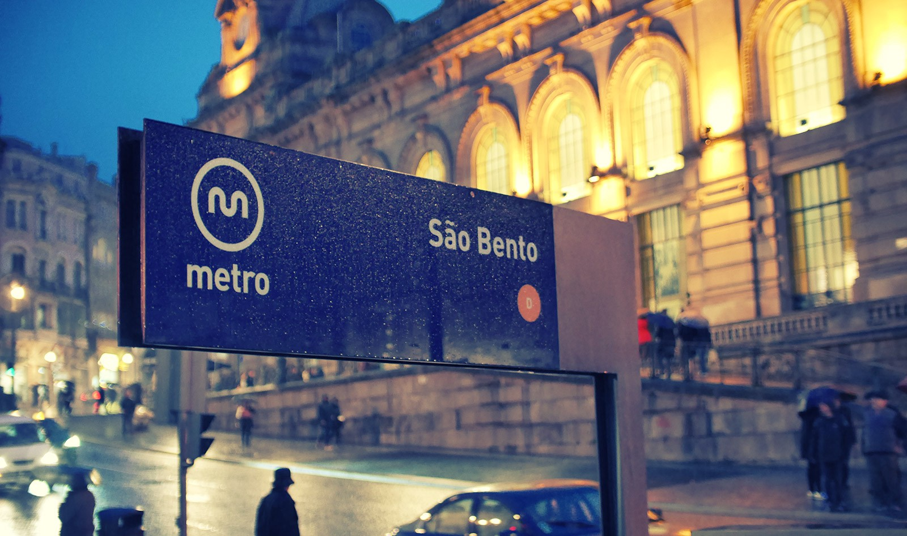

> ⚠️ Heads up! This article is heavy on images and if you scroll to the end, you’ll have consumed 11mb in data. You may want to save it for later if you’re on a strict mobile phone data plan.

Few things are more fascinating than cities. Having lived in a few different countries around the world by now (🇵🇹🇬🇧🇩🇪🇨🇦) , I’m constantly thinking about how one city feels different than the previous: the little details that made London _feel_ like London; what made Berlin _feel_ like Berlin. While the answer to this has been the subject of many books and involves disciplines from socioeconomics, intercontinental conflicts, to architecture, today I’d like to focus on one undeniably important aspect that plays a major role in defining a city who has one: **the subway system.**

Today, we’re having a look at some of the world’s most iconic subway (or metro, or tube) systems, and their respective **typography choices** and design background.

While doing the research for this, something became quite clear: it’s never a _simple_ story to tell. Some cities are so historically rich that their typographical history still partly blends with their past, often impeding the new design choices from going forwards. Some of the reasons for that often go back for centuries; sometimes, the city itself refuses to let go of the past.

---

### Paris 🇫🇷

[**Parisine**](https://typofonderie.com/fonts/parisine-family/#details) is the official typeface for the Paris subway system (it is used in the Paris Métro, tramways, buses and RER parts operated by the RATP _Group in Île-de-France_) since 2015. It was designed in late 1996 by Jean-François Porchez, and ever since then it has seen its own super family grow quite rapidly.

But Paris, much like Berlin as we’ll soon see, is also a wonderful reflection of the city’s complex and rich design history and historical background, and you’ll still see plenty of typefaces and design variations around it. As you’d expect, Paris is… delicately complicated.

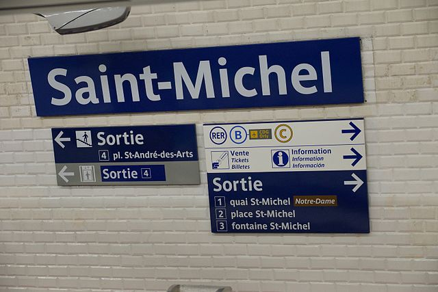

If you’ve spent a good amount of time in Paris, maybe you’ll remember seeing a different style of subway signage, with white uppercase names on a dark blue background. This is/was the **Métro Alphabet**, and it goes back to the 70’s when the first RER lines were being constructed and more care was needed to be given to signage. At the time, [_Univers_](http://www.historygraphicdesign.com/the-age-of-information/the-international-typographic-style/735-univers) was the default typeface being used, but RATP commissioned **Adrian Frutiger** to redraw it for the Métro. The result was the signage that can still be found all over the subway, like the one below at _Place Des Fêtes_:

The construction of the first RER lines in the 1970s meant more thought was given to signage. The colours of station signage on the RER reverted to white text on a blue background, using **_Univers_** as the typeface. But RATP wasn’t completely satisfied with the RER signage, and asked Univers designer Adrian Frutiger to draw a special version for the Métro. He did, though it was decided to use _Métro Alphabet_ only to replace damaged signage, or signage which carried out-of-date information. This distinctive all-caps signage can still be found all over the Métro.

> _Parisine_ was specifically designed to be better than Helvetica as far as legibility goes. Compared to it, [it has numerals which are more readable and very strong terminals](https://typofonderie.com/fonts/parisine-family/#details), as well as a more condensed feel to it.

Given that Paris has some long station names, this was certainly an intentional design characteristic, too. See below how it compares to Helvetica.

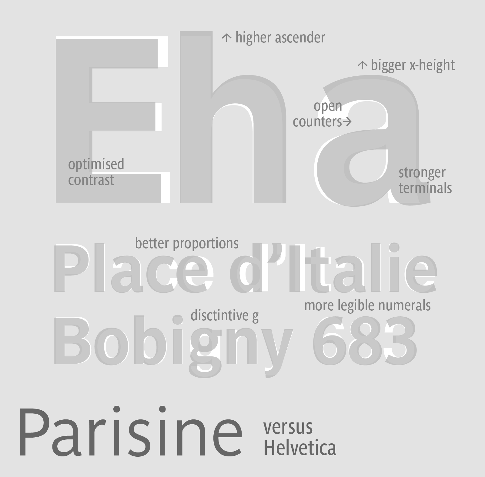

There is one detail I’ve found _Parisine_ not to excel at, and that is the distinction between the numeral zero (0) and the lowercase o (o).

As an example, the last character in these inputs (the one highlighted in the image below) is the lowercase letter “o”, next to the zero. Notice how it’s virtually impossible to distinguish them.

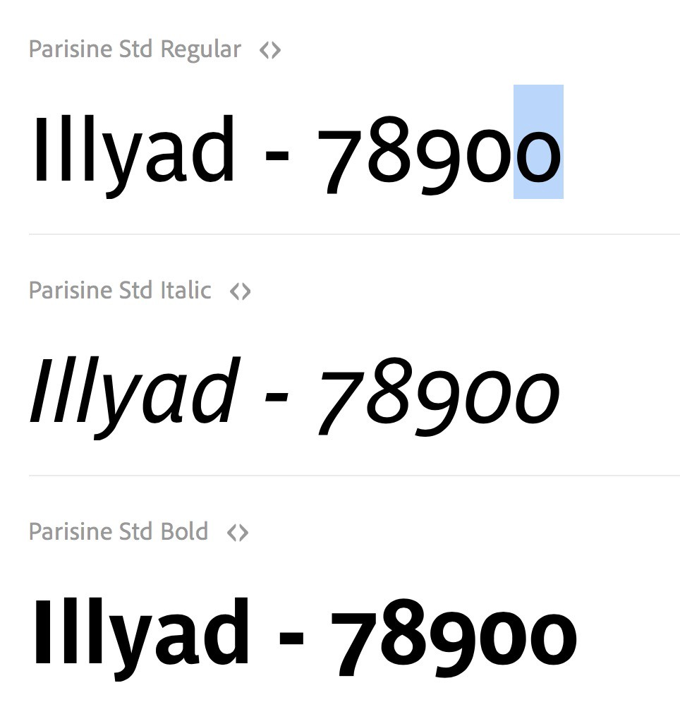

_Parisine_ is also available [from TypeKit](https://typekit.com/fonts/parisine), and by now it has grown up to 16 different styles and weights.

A conversation about Paris wouldn’t be complete without talking about the iconic _Metropolitan_ signs, which are certainly part of the charm of the Paris metro… but for brevity’s sake, I’ll just leave this [great article by Paris Step](http://www.paristep.com/en/articles/architecture/guimard.html) for now… to be followed up on a second part!

In the meantime, [The Beauty of Transport](https://thebeautyoftransport.com/2017/10/18/parisine-paris-johnston-london-parisine-typeface-by-jean-francois-porchez/) has a great article with plenty of information about it, if you want to know more. But for now, let’s move to Germany.

---

### Berlin 🇩🇪

_Einsteigen, bitte._

Oh, my Berlin. This section could make its own book, so we’ll try to merely be factual about this fantastic city where I had the pleasure to live for a couple of years. Typography alone would be a good enough reason to stick around for a while in Berlin, and we’ll only cover what’s underneath the surface (pun intended).

Officially, [**FF Transit**](https://www.myfonts.com/fonts/fontfont/ff-transit/) is the typeface of the **BVG** designed by [**MetaDesign**](http://en.metadesign.com) in 1997. But the story of the Berlin transportation system is very far from being _that simple_, and much has been written about how you can almost literally trace Berlin’s own history throughout time just by carefully observing its (many!) typefaces in use.

)](./asset-6.jpeg)

Starting with its age: Berlin’s U-Bahn is 116 years old, which is… old. [Kate Seabrook](http://www.kateseabrook.com/) described the Berlin Underground once as:

> “It’s essentially like an underground art gallery,”

On a [The Guardian article](https://www.theguardian.com/cities/2015/mar/11/berlin-u-bahn-typography-history-city) from 2015, Anton Koovit made the following remark while observing the many fonts of the different Berlin’s underground lines:

> “It was like an odd mix of archeology and trainspotting”, he says. “Given that it was so heavily bombed in the second world war, Berlin can look like most other European cities above ground. But under the surface there is all this amazing history”.

Depending on which line you board, and how damaged/struck by the historical events it was hit, you can find **FF Transit, Octopuss, Helvetica**, and loads, loads of **Blackletter** type. What gives, Berlin? Well, it’s a beautiful and seemingly never-ending type ride. Berlin has separate entities for its underground and overground (_U-Bahn/S-Bahn_), and therefore their visual identity is significantly different: to note, the S-Bahn is about 95 years old already, and it would be odd if it didn’t have an interesting and unique design background deeply attached to it as well.

Perhaps unsurprisingly, design choices in these stations varies the most between East and West Berlin, showing the consequences of a once divided German capital. On the East, the infamous U7 line alone has 6 different design schemes.

Kate Seabrook went through a lot of hassle capturing pretty much a snapshot of all Berlin’s subway stations in her [Endbanhof](http://endbahnhof.tumblr.com), if you fancy spending an evening browsing around (and you should).

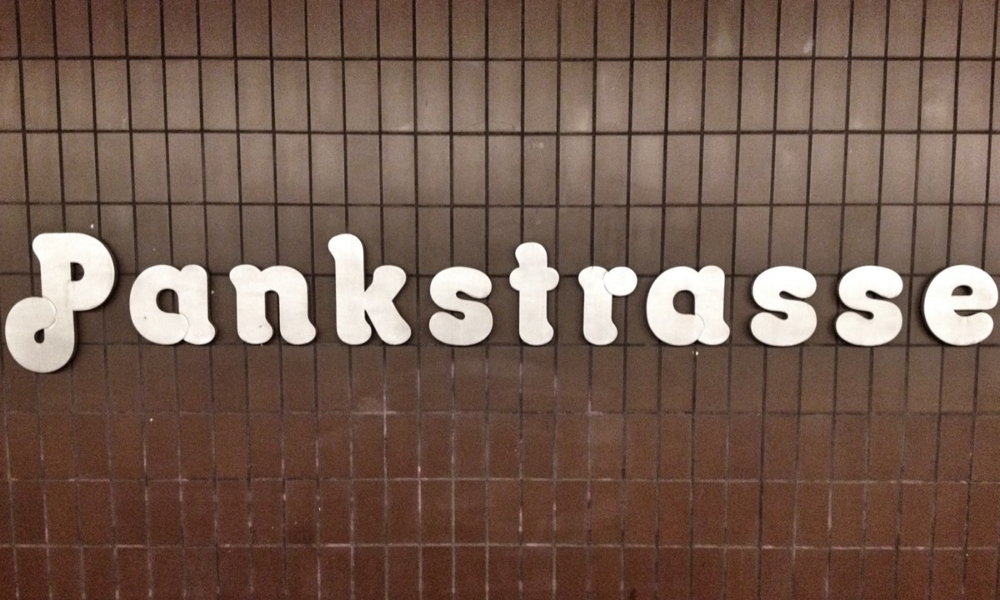

#### But back to FF Transit…

Despite the sheer epicness and visual treat that is commuting across lines in Berlin, _FF Transit_ is still the _de facto_ typeface, which is also used in several other transportation systems (which we’ll get to soon). However, I find that _FF Transit_ is not without its minor faults, as some characters like _l_ and _I_ are visually similar. Have a look at the word “Illicit”:

While the uppercase “I” is cleverly distincit by being shorter than the lowercase “l”, it can still make up some visual confusion with certain combinations of letters. While custom typefaces can get away with details like these when their context is known, it’s not necessarily future-proof. There are no subway stations names in Berlin with these combinations of letters, but who says there won’t be? The cost of a updating a typeface which in turn reflects itself in the real world, unlike an app, is sometimes literally set in stone and can be quite hefty.

**Different Lines, different Type Choices**

As mentioned at the beginning, Berlin street and underground typography easily makes a book on its own. The blog _BerlinTypography_ has two fantastic articles on two distinct lines, the [beautifully odd U7](https://berlintypography.wordpress.com/2017/07/11/the-many-faces-of-the-u7/) and [the S1 line](https://berlintypography.wordpress.com/2017/05/09/the-many-faces-of-the-s1/), just to start.

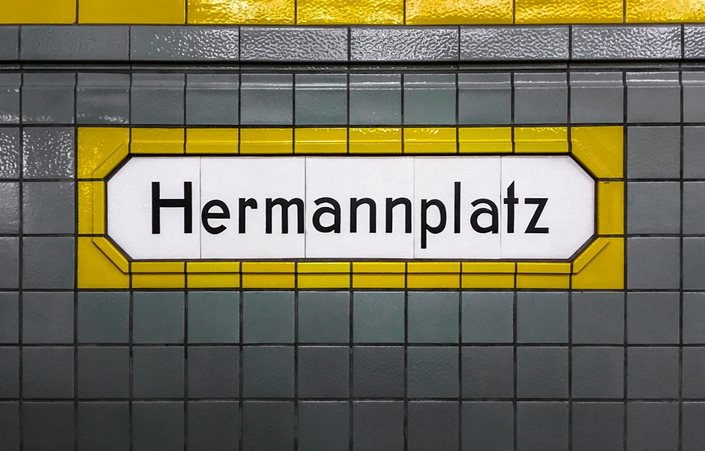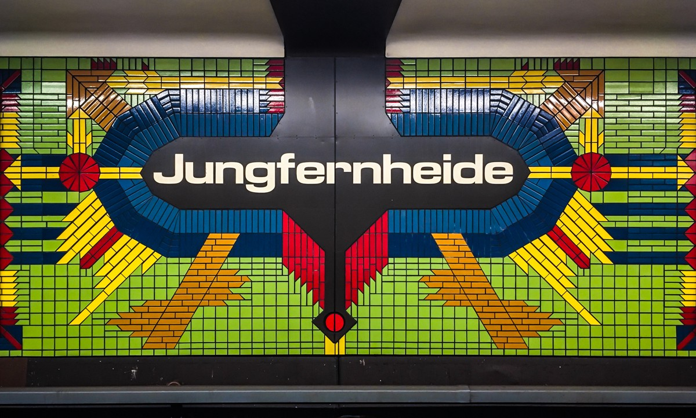

One of my favourite details is the _umlaute_ at **Schöneberg** for the S1 line, which seems to be thought of after the sign was already implemented. It’s a very functional sans-serif, which contrasts with the heavy usage of Blackletter in the rest of the same line. Look at that geometry in the G!

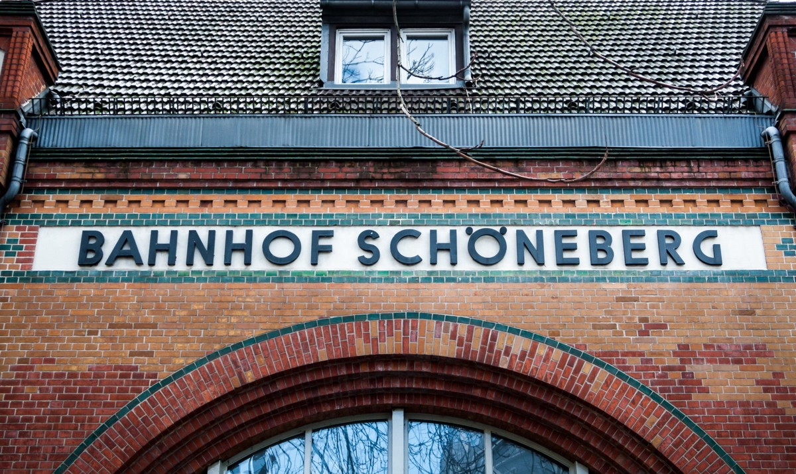

[Philip Oltermamm](https://www.theguardian.com/cities/2015/mar/11/berlin-u-bahn-typography-history-city) dug up a few other interesting bits about the reasons for such discrepancies:

> Yet incongruity is part of the game. At Fehrbelliner Platz the mosaics hang only a few metres away from another sign spelling out the same stop in late 70s Helvetica, on a backdrop of brown and orange.

> At Wittenbergplatz, one of the three platforms has a station sign in the style of the London Underground, gifted to the station by a British city commander in 1952.

And if you need more proof, let’s get visual again:

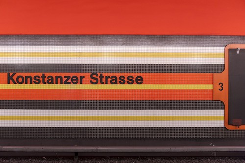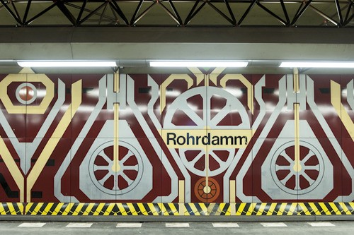](./asset-15.jpeg)

---

### Brussels 🇧🇪

Brussels may be _petit_, but it was also certainly worthy of having its own typeface developed. Since 2006, Brussels has been using **Brusseline**, designed by [Eric de Berranger](http://deberranger.fr/brusseline), a Paris–based type designer. Notice a pattern with the French names for typefaces?

I love _Brusseline_, as well as the whole design system of this subway. It has a very cheerful and unique character to it:

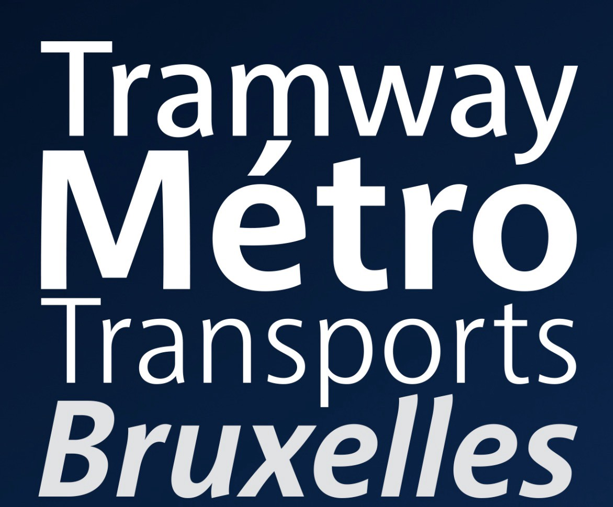

It’s certainly no _Helvetica_ or _Univers_: its curvy characters not only give it a quirky and recognisable look and feel, they also help to erradicate the usual type crimes suspects: characters that are too similar. Those little curves help identify characters from far away distances. As someone with the eyesight of a potato at faraway distances, I certainly appreciate that 🤓

](./asset-17.jpeg)

You can see more at Eric’s official typeface [presentation on Behance](https://www.behance.net/gallery/32534207/Brusseline).

### Toronto 🇨🇦

The _Toronto Transit Commission_ opened doors to its subway in 1954, and it has also seen a fair share of typographical attention over half a decade.

](./asset-18.jpeg)

[**Toronto Subway**](https://www.myfonts.com/fonts/quadrat/toronto-subway/) is a geometric sans-serif typeface designed for the original section of the Toronto Transit Commission’s Yonge subway. However, you’d be forgiven for thinking that Helvetica is still the official typeface for Toronto’s subway: you’ll still find it in some tiled sections of the walls. The font was recreated by David Vereschagin in 2004.

> “**_It was as if it was designed by an engineer and not a typographer”_**, says type and graphic designer David Vereschagin.**_“To see the Toronto Subway lettering fall into disuse and being absolutely eradicated is really sad.”_**

](./asset-19.jpeg)

But there’s something very quirky about Toronto’s typeface: it was literally **traced by hand**, when the time came to redesign the font.

> “And because no one knows who designed the original font or has access to the documents on which it’s contained, Vereschagin set about to create a faithful alphabet by visiting stations and making rubbings of the sandblasted letters on the original Vitrolite glass tiles. When this proved impossible he took photographs.”

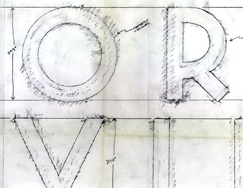.](./asset-21.jpeg)

And some of the old tiles using it, below.

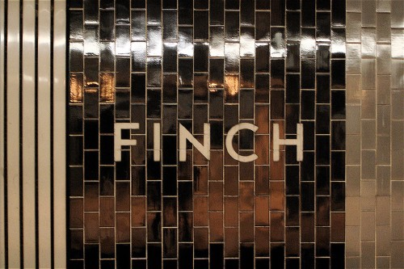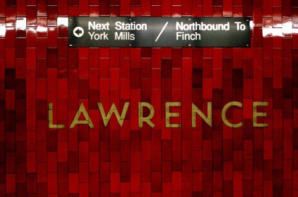

---

### Munich 🇩🇪

Munich also got to have its very own typeface for its transportation system — named **Vialog** (which my auto-correct tried to change to Dialog at least 8 times throughout this post). _Vialog_ was developed by Fuenfwerken as part of the _Munich Transport Authority_ in 2002. However, it was based on the forms on Euro Type, an unpublished typeface originally sketched out in 1988. [From LinoType](https://www.linotype.com/53981/vialog-family.html):

> For Vialog, Schneider made comprehensive legibility studies of the existing European transportation fonts, and combined and adapted the best features to make a new information system font family. He fine-tuned Vialog’s characters and spacing with a special regard to the legibility problems of transportation settings, such as viewing type at distances and while moving.

What I most like about _Vialog_ is that it already took into account the most common legibility problems, such as easily mistaken I/i, j and J. It also features quite a generous and proportional _x-height_, which makes it perfect for short-running text which needs to be legible in poor conditions.

](./asset-25.jpeg)

You can [**try Vialog via LinoType**](https://www.linotype.com/53981/vialog-family.html). It’s quite surprising that is has plenty of variants too, ranging from Light to Bold. The typeface has done so well in field tests that it’s being now used throughout all the transit network in Munich, which includes commuter rails, trains, roads and of course, the subway system.

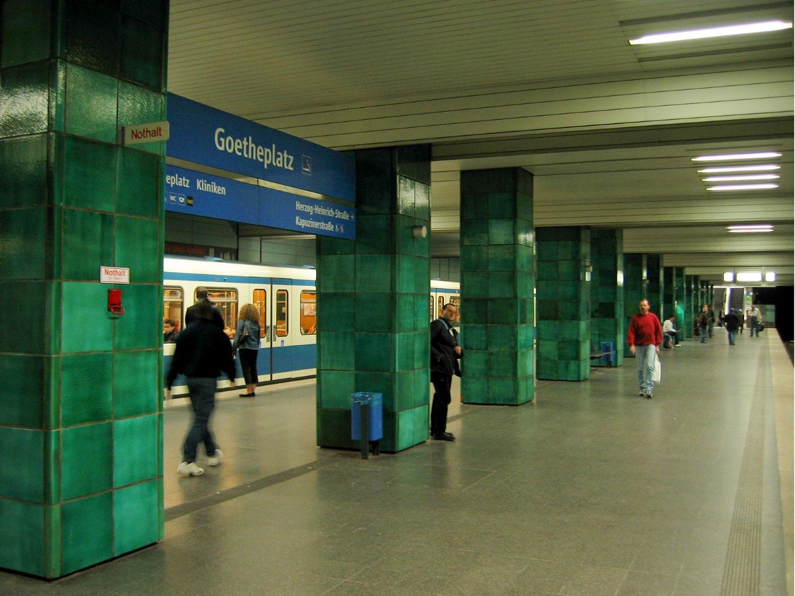

---

### London 🇬🇧

_Mind the gap between the train and the platform._

London was also home to me, for a few years, where I had the chance to get absolutely obsessed with Britain’s commitment to typography as something highly functional and recognisable. Luckily, TfL’s (Transport For London) typeface history is the easiest to search for, as books, documentaries, short-films and countless articles have been written about the iconic Tube’s typography. **Johnston Sans** is its name, aptly named after Edward Johnston who first designed it in 1916. It classifies as a humanist sans-serif typeface, and the fact that it’s been the official type for London’s Transport system since 1916 also makes it one of the [oldest examples of corporate branding currently in use](https://en.wikipedia.org/wiki/Johnston_%28typeface%29).

**Johnston & New Johnston**

To be perfectly accurate, the typeface we usually see should be referred to as _New Johnston_. The original typeface was designed strictly for wood and large metal printing; all paper prints and documents were still using similar-ish typefaces such as [_Gill Sans_](http://idsgn.org/posts/know-your-type-gill-sans/) _(aka, the Helvetica of England)_. It wasn’t until 1970, when Johnston was becoming a pain in the butt for printers to use properly, that it was redesigned for cold type. This work was performed in 1979 by Eiichi Kono at [Banks & Miles](https://en.wikipedia.org/wiki/Banks_%26_Miles 'Banks & Miles'), which would then produce **New Johnston,** first appearing in subway stations in early 1983.

But of course, there are always exceptions. It’s still possible to find cheeky deviations to the norm, such as a couple of signs at the West Brompton station:

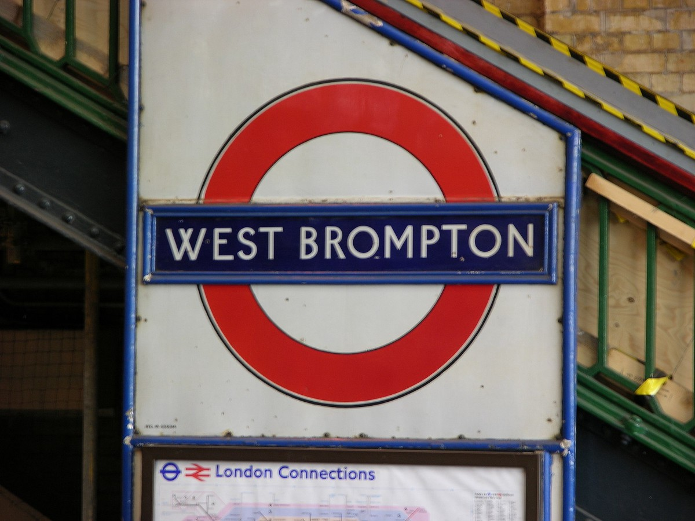

But don’t think Johnston is stuck in time, oh no…! In 2016, London’s TfL made the news by announcing a typeface revamp commissioned by no other than Monotype. Even though its changes were slight, a lot of characters were essentially redesigned to allow the typeface to adapt to modern standards:

> But through its various uses and adaptation to digital technology over the years — signage, maps, websites, advertisements and brochures — the lettering evolved to become too “mechanical and too uniform” says Nadine Chahine of [Monotype](http://www.monotype.com/company/), the Massachusetts-based type foundry commissioned for the special project.

<Embed src="https://player.vimeo.com/video/169691159" aspectRatio={undefined} caption="" />

So in 2016, 100 years after its debut, details like letter spacing, some character’s proportions, even new glyphs (such as the # symbol) were added to Johnston’s original work. This new redesigned typeface goes under the name of **Johnston100**, and it’s meant to start appearing with the ongoing Elizabeth Line.

And if you’re wondering about the changes to some of the glyphs between pre and post-redesign, you can find the two juxtaposed below:

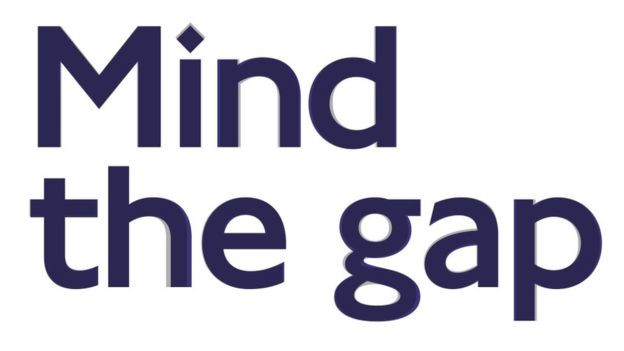

There’s a whole lot more to be learned about the man himself, Johnston, as well as the [whole background history](http://www.bbc.com/news/magazine-35916807) with TfL. Johnston was nothing short of a perfectionist which you can tell by reading this **set of instructions to the printers on how to print a capital E**:

> “In normal Block Letter Capitals (based on the approximately circular O) the limit of Weight is determined by one (or both) of two considerations. 1st by the effect on the transversely divided Caps ABEFPR & to a less extent on HGKXY. 2nd When a “lower case” (or “small letter”) — “l.e.” Is used, to match the Capitals. (Note: it is convenient to express the Weight of a letter by the stem-width of thickness compared with the Stem-Height…)”

> 1st in a transversely divided letter of a very heavy make there may be very little, or even insufficient, Background (especially above the transverse bar). Compare two heavy Es . It is seen that in E of W + H over 5 the upper & lower parts of Background xx are about the same width or thickness as the E’s arms or stem.

And you thought your design team was meticulous…!

---

### Prague 🇨🇿

[**Metron Pro**](https://www.myfonts.com/fonts/storm/metron/), designed by Jiří Rathouský, was commissioned very early on, and in fact it was done so 4 years before Prague’s subway system opened to the public. Since 1973 it has been, in theory, the main font of the design for the _Metroprojekt_, but only used on its lines A and C.

Fast-forward ten years, and it looks like Rathouský’s work started to be disappear en masse; you can still find it in some of the _Czechoslovak Railways_ stations, however, by what seems to be _Helvetica_. Prague has a distinct but subtle design system, and when it’s seen, _Metron Pro_ does most of the work with a very recognisable set of characteristics:

](./asset-32.jpeg)

_Did you notice the double ff ligature?_

As of 2018, _Metron Pro_ has been extended to multiple weights, and had its own set of diacritics (especially important in Czech) revised in 2014. It looks like there’s a new attempt at re-introducing a revised Metron as the default typeface for Prague transportation, though I couldn’t find any official information on this.

](./asset-33.jpeg)

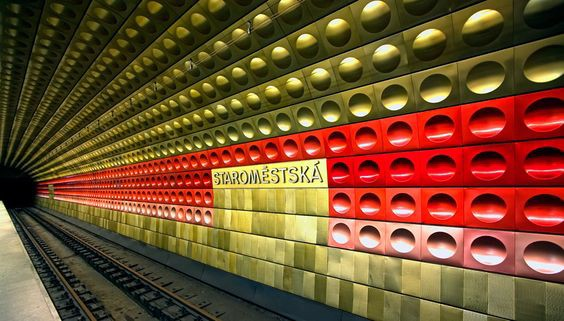](./asset-35.jpeg)

---

### Lisbon 🇵🇹

Lisbon’s subway/metro system also had its own custom typeface developed, called **Metrolis** (full name, **Metrolis Sinalética**) and it was designed by Freda Sack and David Quay. It’s a very efficient typeface which leaves a lot of room for the unique style of each subway station to take over its personality, and it’s certainly underrated in the typographic world of transportation, despite being around for quite a few years.

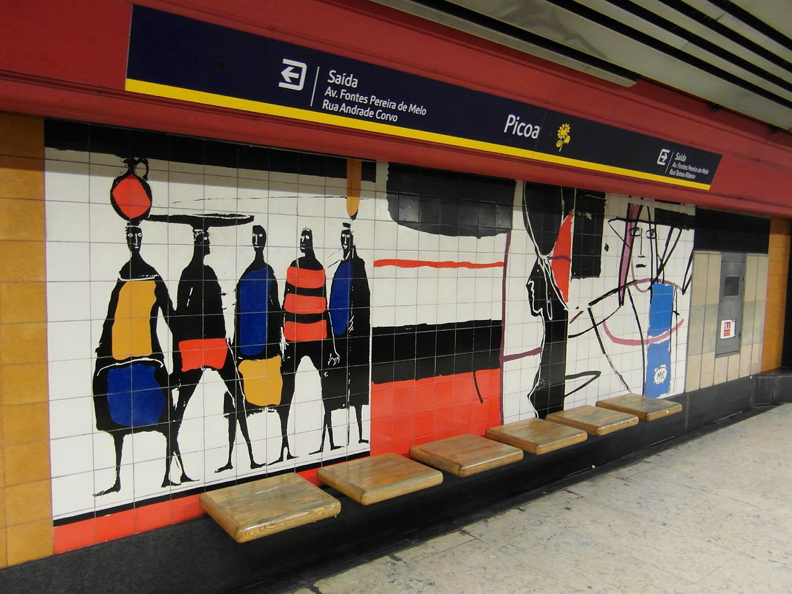](./asset-37.jpeg)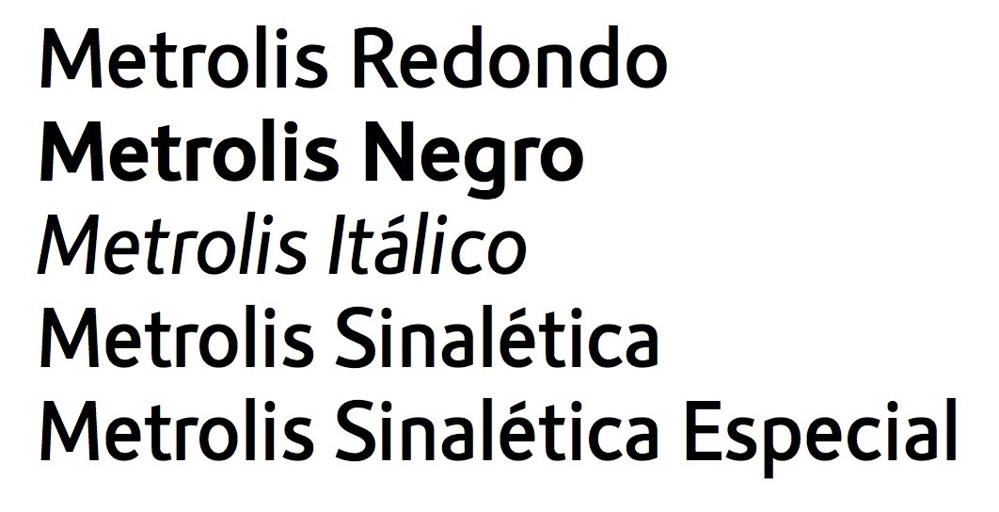

A nice touch that you can find in its [design manual](http://www.metrolisboa.pt/wp-content/uploads/manual_gr%C3%A1fico2011.pdf), closely related to the typeface rules and grid system, is how the different lines also received a **distinct icon/symbol** so they could all be recognised by colour blind, illiterate and visually impaired users:

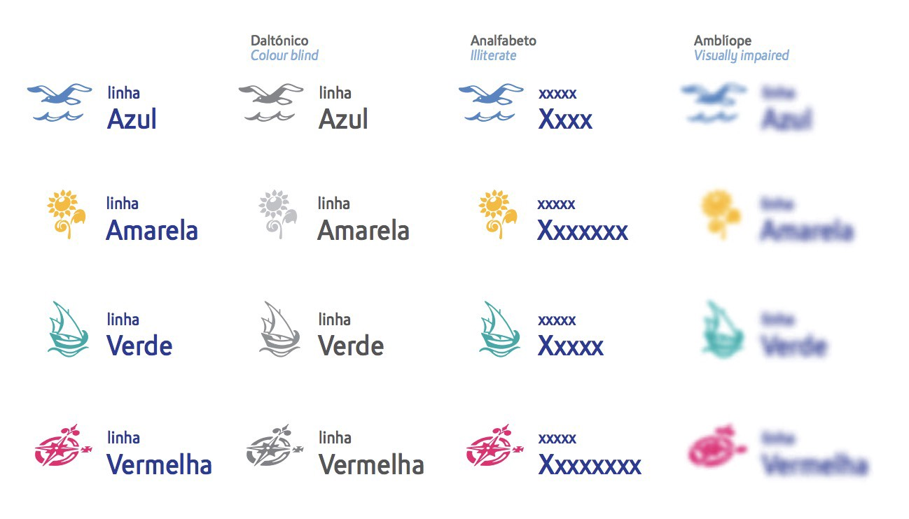

Typography is also influeced by the Subway line colour, with its fill and exit signs being coloured in their respective line’s design.

Lisbon’s subway stations have unique designs that you probably don’t want to miss if you’re around. Typography plays only a minor role in Lisbon; these underground stations have wall art that has been commissioned over 25 years and no station looks the same.

> **Maria Keil** **designed artistic wall coverings for the Lisbon Metro** over a period of roughly 25 years — from her first commission in 1957 to her final work in 1982. She **provided designs for a total of 19 stations.**

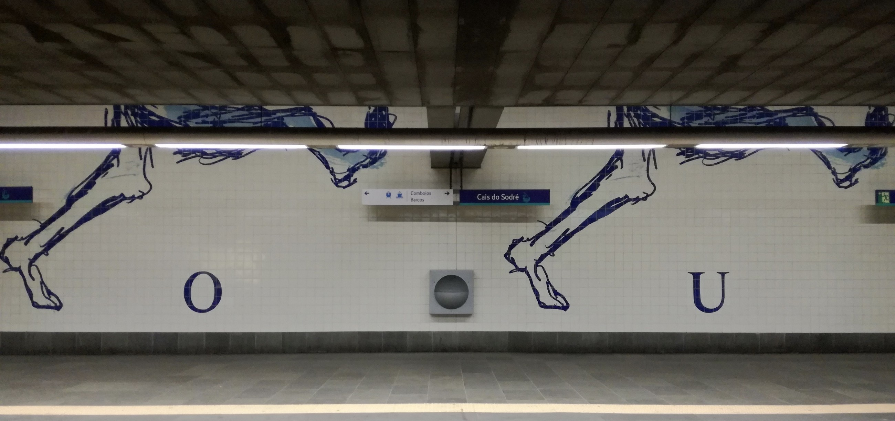

There’s a ton more artwork that you can check in this [Pinterest collection](https://www.pinterest.pt/portugalcnfdtl/lisbon-metro-station-design/?lp=true).

---

### Montreal 🇨🇦

_Prochaine station: Laurier_

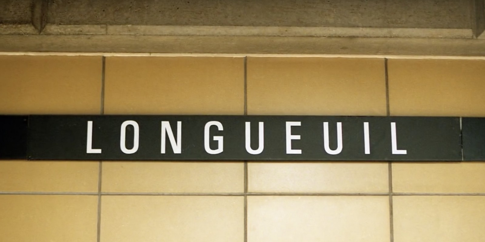

Beautiful Montréal, my current home 🍁. Since 2015, STM has been rolling out [**FF Transit**](https://www.myfonts.com/fonts/fontfont/ff-transit/) for its signage in metro stations, the very same typeface you might remember from the previous Berlin roundup. Montreal also has a few Easter eggs, like the entrance to _Square-Victoria OACI_ being a homage to _Metropolitain, Paris–style_:

](./asset-43.jpeg)

_(and on a side note, right behind this entrance you’ll find the fantastic Shopify office. Little did I know that when I first shot this, I’d be working right there…_ 😍*)*

But the most astute of you will have noticed that it’s still possible to see signage that’s set in **Univers**; and you’d be right, since this was the typeface prior to the release of FF Transit. From STM themselves:

> Transit customers will notice several changes, including the use of a new typography (character font), **_FF Transit_**, to make information easier to read. Specifically designed for signage, the new font is reminiscent of the one currently used, **_Univers_**. A new distinction is introduced in the way the information is displayed: a white background is used for services and aboveground destinations, like streets and bus lines, while a black background was kept for all destinations reached by métro.

But **Univers isn’t going away anytime soon**. Much like other cities which enjoy keeping a visible record of their heritage, STM in Montreal also plans on doing the very same. This citation came straight out of [their press release](http://www.stm.info/en/press/press-releases/2015/the-stm-rolls-out-new-signage-in-metro-stations) when FF Transit was announced:

> “In consideration of the métro’s heritage, the font used when the métro first opened and which has remained unchanged since, **Univers 57**, will still be used for station identifiers along train platforms and above station entrance doors.”

### How wonderful is it when a city recognises its own heritage in type, and does what it can to preserve it?

Once again, the changes from _Univers 57_ to _FF Transit_ might be hard to notice at first. Here’s a side by side for the letter “a”, which:

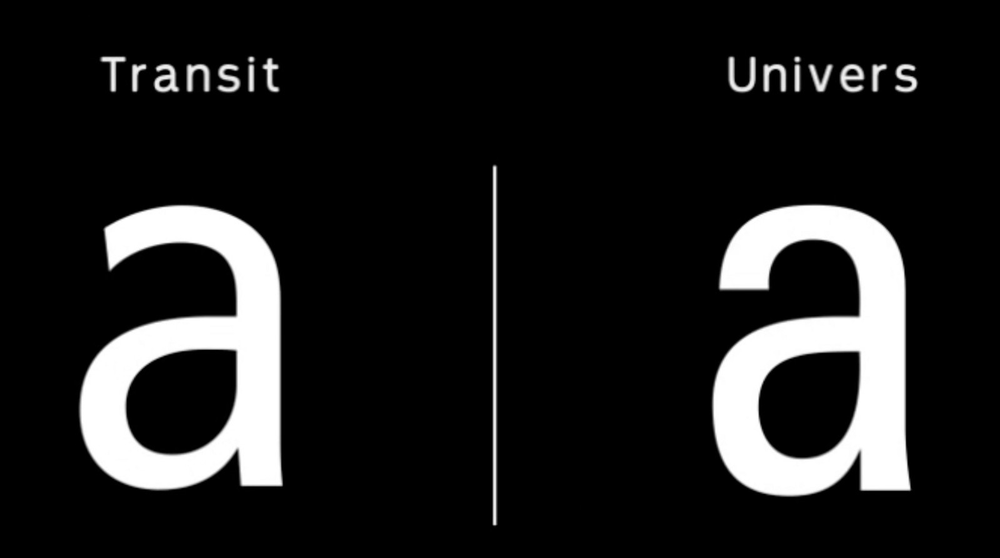

But _FF_ _Transit_ is much more accessible under certain difficult conditions, like blurred vision for example. _Transit’s_ shapes are more recognisable when they’re blurred, compared to _Univers_ which has tighter counters. STM has also adopted a unique language to differentiate what’s overground from overground, despite maintaining the same design rules. As an example, Montreal underground signage has a dark background, unlike its overground counterpart which is white:

Their press release video from 2015 does a remarkable job at explaining the intents behind the new type choices and design language, so give it a watch!

<Embed src="https://www.youtube.com/embed/ig4Z6EL_KU4?feature=oembed" aspectRatio={undefined} caption="" />

—

And we barely scratched the surface on the topic… New York didn't make this list only because then it would be too long; the same for Moscow with its beautiful station designs, and I’m on my way researching non-latin typography on Eastern underground systems, which isn’t that easy to get information on.

> In the meantime, if you’re interested in everything-fonts, typography and language, feel free to subscribe to [**Coffee Table Typography**](http://ricardofilipe.com/coffeetabletype/), a bi-weekly newsletter with highly curated stories on typography (and coffee). No spam, ever. Just for the sheer love of words. [You can have a look at the latest edition](https://www.getrevue.co/profile/coffeetabletypography/issues/43-dashing-swashes-for-84634).

### Resources

1.  [A list with subway typeface names](http://mic-ro.com/metro/metrofonts.html)
2.  [Typophile Forum: Subway Fonts](http://www.typophile.com/node/30981)
3.  [Montreal Press Release for FF Transit](http://www.stm.info/en/press/press-releases/2015/the-stm-rolls-out-new-signage-in-metro-stations)
4.  [Lisbon’s Subway Design Manual](http://www.metrolisboa.pt/wp-content/uploads/manual_gr%C3%A1fico2011.pdf)
5.  The [Endbanhof Project](http://endbahnhof.tumblr.com)
6.  London’s [Johnston Typeface on Wikipedia](https://en.wikipedia.org/wiki/Johnston_%28typeface%29)
7.  [BBC article on Johnston](http://www.bbc.com/news/magazine-35916807)
8.  [Prague City Transport](http://www.prague.fm/city-transport/)
9.  [Univers, by Adam Frutiger](http://www.historygraphicdesign.com/the-age-of-information/the-international-typographic-style/735-univers)
10. A story of [Toronto’s Subway in type](https://joeclark.org/appearances/atypi/2007/TTC/inscribed/)

> Did you enjoy this article? Would you be interested in a follow up article with other subway systems in the world? Let me know! Tweet it, clap it, comment, or print it and tape it to a tree.

---
